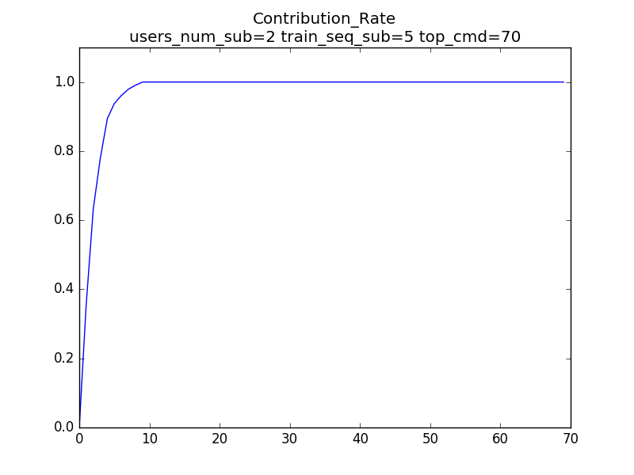

# Q2 Anomaly Detection via "Eigenface" of Command History

* For performance reason:
    * Just test a **VERY VERY smell data set**
    * Use some magic-numbers
    * Simplify Qg
        * Just test User 2

## Qa

* a. Divide each input into a series of sequences of L = 100. Construct the co-occurrence matrix for each user (for each sequence). Choose a window size ​w ​ for your experiments. What are the values for ​m ​ (total # of commands) and ​n ​ in the provided dataset? For users 1 and 2 what is the co-occurrence of `rm` with `ls` (`ls` following `rm`) for 5 of the 50 sequences (choose the sequences)?
    * m, total # of commands: $$635$$
    * n, total sample sequence: $$50 * 50 = 2500$$
    * rm-ls (in that order) co-occurrences
        * User1: $$[0, 1, 3, 1, 1]$$
        * User2: $$[1, 0, 0, 0, 0]$$

## Qb

* b. Normalize the matrices to be centered at 0, so that co-occurrences with less than average frequency would have negative values. What type of mean calculation did you choose? What are the values for user 1 and 2 for relationship between `rm` and `ls` for those sequences you chose earlier?
    * Normal mean
    * [[-0.7  0.3  2.3  0.3  0.3]
    * [ 0.3 -0.7 -0.7 -0.7 -0.7]]

## Qc

* c. Calculate Covariance Matrix by first rearranging the matrices from (b) into a vector.
    * Covariance Matrix: 8.1

## Qd

* d. Find the eigenvectors of the covariance matrix and sort them by the eigenvalues. Plot the contribution rate (equation 8, AnomalyDetection.pdf) to find a good dimension of the feature space (N). Note that each eigenvector is semantically a matrix converted into a vector -- so it can be transferred back into a ​m*​m ​ matrix. These matrices is what we call “Eigen co-occurrence matrices.” [See first revision at the end of the doc]

## Qe

* e. Find the feature vectors for users 1-5 and report the feature vectors for users 1 and 2 for their first 5 sequences. Report these in user1FV.csv and user2FV.csv

## Qf

* f. Construct the network layers described in the paper for users 1-5 (for each sequence) -- either Layered Network Model or Combined Network Model. Specify which you choose.

## Qg

* g. For each test sequence for users 1-5, evaluate the algorithm by constructing co-occurrence matrix and mapping it into Eigen matrix space. Then compare the network similarity to the networks you have associated with that user. Classify each sequence as anomalous or friendly. Report back the false positive and false negative rates (you can include more users for extra credit). This section is open to experimentation and you are free to deviate from the authors’ testing strategies.
    * For performance reason:
        * Just test a **VERY VERY smell data set**
        * Just test User 2
    * Use some magic-numbers
    * err_rate = 0.26

## Qh

* h. Classify the test sequences of user 21 as anomalous (1) or benign (0) and submit it as a user21.csv file with 100 entries (1 classification for each test sequence).
