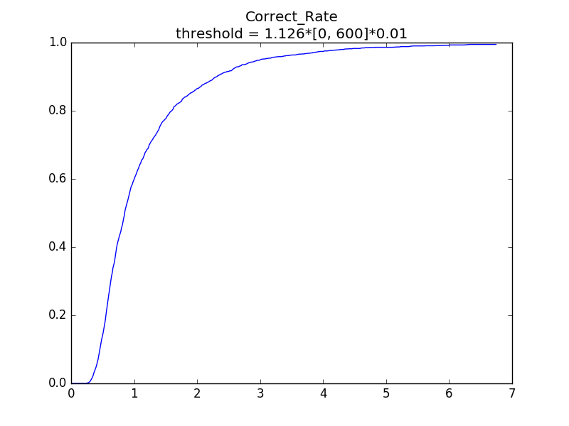
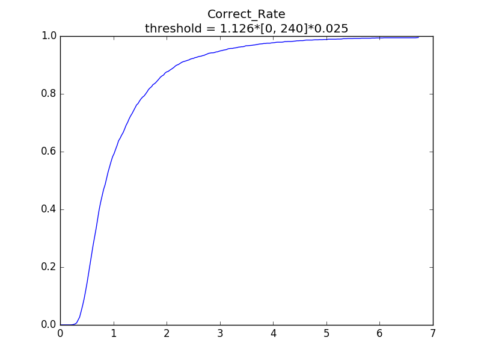
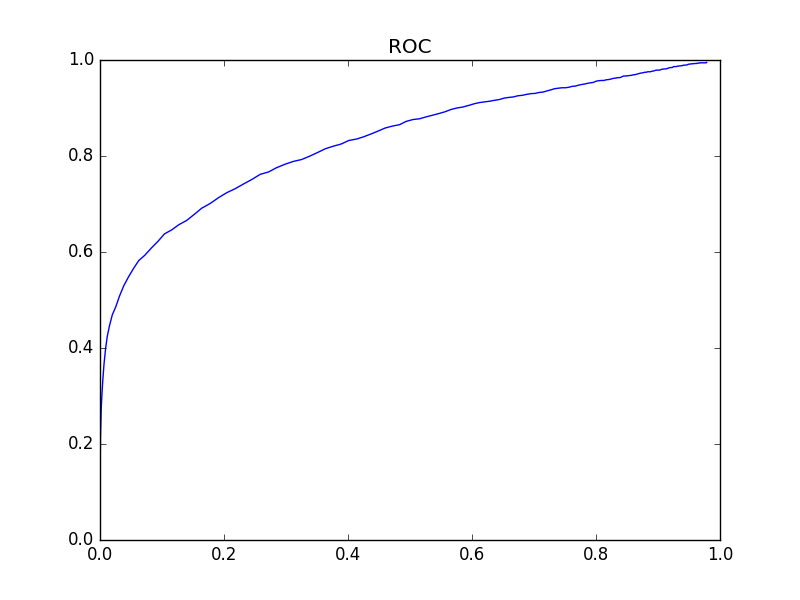

# Continuous Authentication via Biometric Behavior

## Questions

* What is your general approach to this problem?

* What features did you select and why?

* Analyze the successes and failures of your algorithm. Provide an ROC curve showing the tradeoff between detecting true positives vs false positives.

* Submit answer.csv in response to the test dataset, labeling ​each row as coming from that user or not (Notation: 0 for real user, 1 for masquerader). The test dataset contains 3 independent rows per user, so you should provide a label for each of the rows.

* Extra credit: for those that you selected as masquerader, provide top 5 users that are closest

## Goal

* Identify a test record is anomalous or not

## Trainning data

* subject: 
    * 51 subjects
    * s0xx
    * s002-s057
    * Lost $$[6, 9, 14, 23, 45]$$
* sessionIndex: $$[1,...,8]$$
* rep: $$[1,...,47]$$
* $$\{\text{H},\text{DD},\text{UD}\}$$
* $$[\text{period},\text{t},\text{i},\text{e},\text{five},\text{Shift.r},\text{o},\text{a},\text{n},\text{l},\text{Return}]$$

## Feature

* `mean`, `std` for every **subject** every **session**
* It is not necessary to remove redundance data, when using manhattan distance
* Useless Feature
    * Assume a idealized subject **the_one**
        * Combined by every **subject**
        * Calculate `the_mean`, `the_std` for every **session**
    * The features of every **subject** are `mean_manhattan` and `std_manhattan`
        * The manhattan distance between **subjects** and **the_one**
    * **We cannot calculate `mean` and `std` for a single test data**

## Cross-validation(Holdout)

* leave 5 **rep**s for every **subject** every **session** (10%)
* Current Rate [0, 600] (TPR)

* Current Rate [0, 240] (TPR)

* ROC FPR-TPR

* Actually, threshold is used to exclude out outliers
    * The anomalous data can be regarded as outliers

## Reference

* [Keystroke Dynamics - Benchmark Data Set](http://www.cs.cmu.edu/~keystroke/)
* Kevin S. Killourhy and Roy A. Maxion. "Comparing Anomaly Detectors for Keystroke Dynamics," in Proceedings of the 39th Annual International Conference on Dependable Systems and Networks (DSN-2009), pages 125-134, Estoril, Lisbon, Portugal, June 29-July 2, 2009. IEEE Computer Society Press, Los Alamitos, California, 2009.
