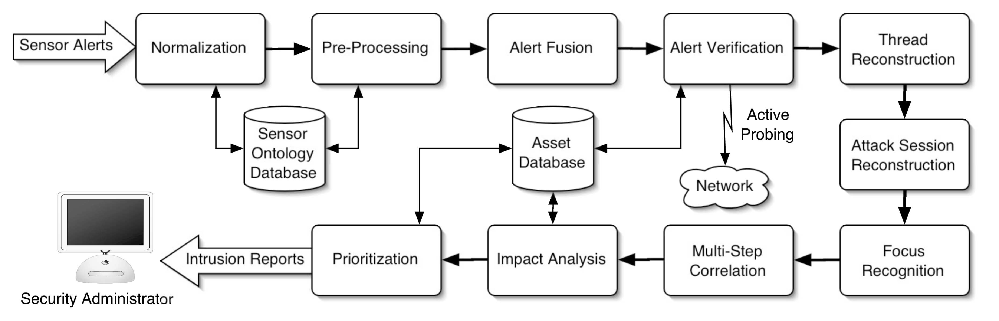

# A Comprehensive Approach to Intrusion Detection Alert Correlation

<!-- TOC -->

- [Background Knowledge and Insight](#background-knowledge-and-insight)
- [Goal and Contribution](#goal-and-contribution)
- [Data](#data)
- [Feature](#feature)
- [Architecture](#architecture)
    - [Components](#components)
- [Alert Process](#alert-process)
    - [Meta-alerts](#meta-alerts)
    - [Example Attack Scenario](#example-attack-scenario)
    - [Alert Normalization](#alert-normalization)
    - [Alert Preprocessing](#alert-preprocessing)
    - [Alert Fusion](#alert-fusion)
    - [Alert Verification](#alert-verification)
    - [Attack Thread Reconstruction](#attack-thread-reconstruction)
    - [Attack Session Reconstruction](#attack-session-reconstruction)
    - [Attack Focus Recognition](#attack-focus-recognition)
    - [Multistep Correlation](#multistep-correlation)
    - [Impact Analysis](#impact-analysis)
    - [Alert Prioritization](#alert-prioritization)
- [Reference](#reference)

<!-- /TOC -->

## Background Knowledge and Insight

* How to cover multiple aspects "as a whole"

## Goal and Contribution

* Comprehensive correlation approach
* Build a Framework

## Data

| Data Set      | Sensors                                      | Duration | Alerts  |
| ------------- | -------------------------------------------- | -------- | ------- |
| IT/LL 1999    | USTAT, Snort                                 | 2 weeks  | 41760   |
| MIT/LL 2000   | USTAT, Snort                                 | 3 hours  | 36635   |
| CTV           | Snort, EBayes-TCP, U-STAT, WinSTAT, Tripwire | 2 days   | 215190  |
| Defcon        | Snort                                        | 2 days   | 6378096 |
| Rome AFRL     | Snort and undisclosed NIDS                   | 4 months | 5299390 |
| Honeypot      | Snort                                        | 10 days  | 260120  |
| Treasure Hunt | Snort, LinSTAT                               | 4 hours  | 2811169 |

* Two existing data sets
   * DARPA
        * MIT Lincoln Laboratory 1999
        * MIT Lincoln Laboratory 2000
    * Defcon 9
    * Shortcoming
        * Created to evaluate IDS, not include sensor alerts
        * Not real environment, not real time
        * Lack of network health monitoring information
            * Difficult to determine the actual impact of the attacks
        * Not include anomalous traffic, non-anomalous behavior
* Three additional data sets
    * Two honeypot systems
        * RedHat 7.2 Linux
        * Microsoft Windows 2000 Server
    * Cyber Treasure Hunt competition
    * Rome Air Force Research Laboratory’s networks
        * No successful attacks.
* Manually perform the correctness of the correction process

## Feature

## Architecture

* Optional
* Parallel
* Feedback as input

### Components

* Normalization
    * Translate alerts to a common format
    * Alerts from different sensors can be encoded in different formats
* Preprocessing
    * augment normalized alerts by assigning meaningful values to all alert attributes
        * Start time
        * End time
        * Source
        * Target
* Fusion
    * Combine alerts representing the same attack by different IDSs
* Verification
    * Determine the success of the single attack corresponding to the alert
    * Decrease the influence of the failed attacks
* Thread reconstruction
    * Combine series of alerts due to attacks by a single attacker against a single target
* Session reconstruction
    * Associate network-based alerts and host-based alerts
* Focus recognition
    * Identify hosts that are source or target of many attacks
        * DoS
        * port scanning
* Multistep correlation
    * Identify common attack patterns
        * Sequence of individual attacks at different points of network
            * Island hopping
* Impact analysis
    * Determine the attack impact for the specific target network
* Prioritization
    * Assign priorities to alerts

## Alert Process

### Meta-alerts

* Definition:
    * Higher-level alerts made via merging
    * Attribute values derived from those of original alerts
* Example:
    * a "portscan" alert composed of a series of alerts referring to individual network probe packets
    * Target attribute: all hosts that were port-scanned
* Representation:
    * A tree with IDS alerts at the leaves
    * Merging done in a BFS fashion

### Example Attack Scenario

| AlertID | Name           | Sensor | Start/End | Source   | Target            | Tag |
| ------- | -------------- | ------ | --------- | -------- | ----------------- | --- |
| 1       | IIS Exploit    | N1     | 12.0/12.0 | 80.0.0.1 | 10.0.0.1, port:80 |     |
| 2       | Scanning       | N2     | 10.1/14.8 | 31.3.3.7 | 10.0.0.1          |     |
| 3       | Portsacn       | N1     | 10.0/15.0 | 31.3.3.7 | 10.0.0.1          |     |
| 4       | Apache Exploit | N1     | 22.0/22.0 | 31.3.3.7 | 10.0.0.1, port:80 |     |
| 5       | Bad Request    | A      | 22.1/22.1 |          | localhost, Apache |     |
| 6       | Local Exploit  | H      | 24.6/24.6 |          | linuxconf         |     |
| 7       | Local Exploit  | H      | 24.7/24.7 |          | linuxconf         |     |

* Victim network
    * Vulnerable Apache Web service on a Linux host (IP: 10.0.0.1)
    * Host-based IDS (H)
    * Application-based IDS (A): monitors Apache Web logs for malicious activity
    * Two different network-based IDSs (N1 and N2)
* Attack process
    * Attacker (IP: 31.3.3.7) first portscans host
        * Discovers vulnerable Apache server (Alerts 2, 3)
    * During scan a worm (IP: 80.0.0.1) attempts Microsoft IIS exploit and fails (Alert 1)
    * After scan, attacker exploits Apache buffer overflow (Alerts 4, 5)
        * Gets interactive  hell as apache user
    * Using a local exploit against linuxconf, attacker becomes root (Alerts 6, 7)
    * Desired output of correlation: Single meta-alert for a multi-step attack against victim host
        * Step 1: Initial scanning (Alerts 2, 3)
        * Step 2: Remote attack against web server (Alerts 4, 5)
        * Step 3: Privilege escalation (Alerts 6, 7)
    * Alert 1 should be discarded as irrelevant

### Alert Normalization

| AlertID | Name         | Sensor | Start/End | Source   | Target   | Tag |
| ------- | ------------ | ------ | --------- | -------- | -------- | --- |
| 2       | **Portsacn** | N2     | 10.1/14.8 | 31.3.3.7 | 10.0.0.1 |     |

* Goal: Unify alert formats form different types of sensors
    * Not need to normalize for only one type of sensor
* Intrusion Detection Message Exchange Format (IDMEF)
    * Proposed by the Internet Engineering Task Force
* Implemented using wrapper modules for different IDSs

| Alert Attribute | Description                                                |
| --------------- | ---------------------------------------------------------- |
| alertid         | A unique ID identifying the alert                          |
| analyzertime    | The time when the IDS sent the alert                       |
| attackernodes   | The set of nodes where the attack originated               |
| attackgraph     | A graph showing the progress of complex attacks            |
| consequence     | A set of systems that are affected by this attack          |
| createtime      | The time when the IDS generated the alert                  |
| detecttime      | The time when the IDS detected the attack                  |
| end_time        | The time when the attack ended                             |
| name The        | name of the attack                                         |
| priority        | A value indicating how important the attack is             |
| receivedtime    | The time the alert was received by the correlator          |
| reference       | A set of references to other alerts                        |
| sensomode       | The node at which the IDS that generated the alert runs    |
| start_time      | The time when the attack started                           |
| type            | The attack type (Reconnaissance, Breakin, Escalation, DoS) |
| verified        | If the attack was successful (true, false, unknown)        |
| victimnodes     | The set of nodes that were victims of the attack           |
| victimprocess   | The full path of the process that was attacked             |
| victimservice   | Port number and protocol of the service that was attacked  |

### Alert Preprocessing

| AlertID | Name          | Sensor | Start/End | Source       | Target                             | Tag |
| ------- | ------------- | ------ | --------- | ------------ | ---------------------------------- | --- |
| 5       | Bad Request   | A      | 22.1/22.1 | **10.0.0.1** | **10.0.0.1** ~~localhost~~, Apache |     |
| 6       | Local Exploit | H      | 24.6/24.6 | **10.0.0.1** | **10.0.0.1**, linuxconf            |     |
| 7       | Local Exploit | H      | 24.7/24.7 | **10.0.0.1** | **10.0.0.1**, linuxconf            |     |

* Some necessary fields are omited
    * Start/End-time
    * Attck Source/Target
    * Additional Information
* Goal: Supply missing alert attributes as accurately as possible
    * Use several heuristics

### Alert Fusion

| AlertID | Name           | Sensor       | Start/End     | Source       | Target       | Tag        |
| ------- | -------------- | ------------ | ------------- | ------------ | ------------ | ---------- |
| 2       | Scanning       | N2           | 10.1/14.8     | 31.3.3.7     | 10.0.0.1     | correlated |
| 3       | Portsacn       | N1           | 10.0/15.0     | 31.3.3.7     | 10.0.0.1     | correlated |
| **8**   | **Meta-Alert** | **{N1, N2}** | **10.8/14.8** | **31.3.3.7** | **10.0.0.7** | **{2, 3}** |

* Goal: Combine alerts representing independent detection of a same attack by different IDSs
    * Combine related alerts not related attacks
    * Not combine alerts produced by the same sensor
* Fusion: Temporal difference between alerts and information they contain
    * Keep sliding time window of alerts
        * Low window size causes related alerts to escape fusion
    * Alerts within the time window stored in a time-ordered queue
    * Upon new alert, compared to alerts in queue
    * Match if all overlapping attributes are equal and new alert is produced by a different sensor
    * Upon a match, alerts are merged; resulting meta-alert replaces the matched alert in the queue
        * New timestamp: earlier start/end-time

### Alert Verification

| AlertID | Name        | Sensor | Start/End | Source   | Target            | Tag             |
| ------- | ----------- | ------ | --------- | -------- | ----------------- | --------------- |
| 1       | IIS Exploit | N1     | 12.0/12.0 | 80.0.0.1 | 10.0.0.1, port:80 | **nonrelevant** |

* Three types Alert
    * True positive
    * Irrelevant positive
        * Failed attack
    * False positive
* Goal: Extending intrusion detection signatures with an expected "outcome" of the attack
    * Real-time verification
    * Visible and verifiable traces left by attack
    * Example: temporary file, outgoing connection
* Passive techniques
    * Depend on the priori information
        * Whether the attack target:
            * Exist
            * Running
            * Reachable
            * Reassemble the packets as expected by the intruder
    * Advantage
        * Not interfere with the normal operation
    * Disadvantage
        * Knowledge base/priori information undated not in time
        * Limitation of the type of information
* Active techniques
    * Looking for the evidence of the success of an attack
        * Established network connection
        * Unknown ports opened (backdoor)
    * Vulnerability scanners
        * Advantage
            * Information is current
        * Disadvantage
            * Visible on the network
            * Consume network resources
            * Cause crash
            * Raise alarm, should be excluded
    * Remote login
        * Advantage
            * Gather high-quality data
        * Disadvantage
            * Configure the target machine

### Attack Thread Reconstruction

| AlertID | Name           | Sensor       | Start/End     | Source       | Target                  | Tag                    |
| ------- | -------------- | ------------ | ------------- | ------------ | ----------------------- | ---------------------- |
| 4       | Apache Exploit | N1           | 22.0/22.0     | 31.3.3.7     | 10.0.0.1 port:80        | **correlated**         |
| 6       | Local Exploit  | H            | 24.6/24.6     | 10.0.0.1     | 10.0.0.1, linuxconf     | **correlated**         |
| 7       | Local Exploit  | H            | 24.7/24.7     | 10.0.0.1     | 10.0.0.1, linuxconf     | **correlated**         |
| 8       | Meta-Alert     | {N1, N2}     | 10.8/14.8     | 31.3.3.7     | 10.0.0.7                | {2, 3}, **correlated** |
| **9**   | **Meta-Alert** | **{N1, N2}** | **10.8/22.0** | **31.3.3.7** | **10.0.0.7, port:80**   | **{4, 8}**             |
| **10**  | **Meta-Alert** | **H**        | **24.6/24.7** | **10.0.0.1** | **10.0.0.1, linuxconf** | **{6, 7}**             |

* Goal: Combines a series of alerts due to attacks by one attacker against a single target
* Merging alerts with equivalent source and target attributes in temporal proximity
    * Set time windows: 120s
* Reduce a lot of alerts caused by brute-force attack

### Attack Session Reconstruction

| AlertID | Name           | Sensor          | Start/End     | Source                   | Target                        | Tag                    |
| ------- | -------------- | --------------- | ------------- | ------------------------ | ----------------------------- | ---------------------- |
| 5       | Bad Request    | A               | 22.1/22.1     | 10.0.0.1                 | 10.0.0.1, Apache              | **correlated**         |
| 9       | Meta-Alert     | {N1, N2}        | 10.8/22.0     | 31.3.3.7                 | 10.0.0.7, port:80             | {4, 8}, **correlated** |
| **11**  | **Meta-Alert** | **{N1, N2, A}** | **10.0/22.1** | **{31.3.3.7, 10.0.0.1}** | **10.0.0.1, port:80, Apache** | **{5, 9}**             |

* Goal: Link network-based alerts to related host-based alerts
* Rough spatial and temporal correspondence between the alerts
    * The host-based attack occurs a short time after the network-based attack
        * Simple but imprecise
    * Priori information
        * Prepare for or to be a precondition for another attack
        * Manually encoded in a knowledge base
    * Sliding time window with extended timeout model
        * New related alert arrives, extend timeout

### Attack Focus Recognition

* Goal: identify hosts that are either the source or the target of a substantial number of attacks
    * DDoS: many2one
    * Port scan: one2many

### Multistep Correlation

| AlertID | Name           | Sensor             | Start/End     | Source                   | Target                                   | Tag                   |
| ------- | -------------- | ------------------ | ------------- | ------------------------ | ---------------------------------------- | --------------------- |
| 10      | Meta-Alert     | H                  | 24.6/24.7     | 10.0.0.1                 | 10.0.0.1, linuxconf                      | {6, 7} **correlated** |
| 11      | Meta-Alert     | {N1, N2, A}        | 10.0/22.1     | {31.3.3.7, 10.0.0.1}     | 10.0.0.1, port:80, Apache                | {5, 9} **correlated** |
| **12**  | **Meta-Alert** | **{N1, N2, H, A}** | **10.0/24.7** | **{31.3.3.7, 10.0.0.1}** | **10.0.0.1, port:80, Apache, linuxconf** | **{10, 11}**          |

* Goal: identify high-level attack patterns that are composed of several individual attacks
* Example
    * Scans a victim host
    * Breaks into a user account on that host
    * Escalates privileges to the root

### Impact Analysis

* Goal: determine the impact of an attack on the proper operation of the protected network
* Heartbeat monitor

### Alert Prioritization

* Classify alerts
* Discard irrelevant or less importance alerts

| Priority | AlertID | Description               | Tag         | Reference |
| -------- | ------- | ------------------------- | ----------- | --------- |
| High     | 12      | Multistep Attack Scenario |             | {11, 10}  |
| Low      | 2-11    | ...                       | correlated  | ...       |
| Low      | 1       | IIS Exploit               | nonrelevant |           |

## Reference

* A Comprehensive Approach to Intrusion Detection Alert Correlation, Valeur et al, 2004
* Lecture 20
