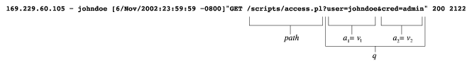

# A Multi-Model Approach to the Detection of Web-Based Attacks

<!-- TOC -->

- [背景知识和启发](#背景知识和启发)
    - [异常检测的假设条件](#异常检测的假设条件)
    - [Web 安全](#web-安全)
    - [Web 相关的攻击检测](#web-相关的攻击检测)
- [论文目标与贡献](#论文目标与贡献)
- [数据样本](#数据样本)
- [数据模型](#数据模型)
- [检测模型](#检测模型)
    - [属性长度](#属性长度)
        - [用户](#用户)
        - [攻击者](#攻击者)
        - [训练](#训练)
        - [检测](#检测)
    - [属性字符分布](#属性字符分布)
        - [用户](#用户-1)
        - [攻击者](#攻击者-1)
        - [训练](#训练-1)
        - [检测](#检测-1)
    - [结构推测](#结构推测)
        - [用户](#用户-2)
        - [攻击者](#攻击者-2)
        - [训练](#训练-2)
        - [检测](#检测-2)
    - [令牌查找器](#令牌查找器)
        - [用户](#用户-3)
        - [攻击者](#攻击者-3)
        - [训练](#训练-3)
        - [检测](#检测-3)
    - [属性是否缺失](#属性是否缺失)
        - [用户](#用户-4)
        - [攻击者](#攻击者-4)
        - [训练](#训练-4)
        - [检测](#检测-4)
    - [属性次序](#属性次序)
        - [用户](#用户-5)
        - [攻击者](#攻击者-5)
        - [训练](#训练-5)
        - [检测](#检测-5)
    - [访问频率](#访问频率)
        - [用户](#用户-6)
        - [攻击者](#攻击者-6)
        - [训练](#训练-6)
        - [检测](#检测-6)
    - [请求间延迟](#请求间延迟)
        - [用户](#用户-7)
        - [攻击者](#攻击者-7)
        - [训练](#训练-7)
        - [检测](#检测-7)
    - [调用次序](#调用次序)
        - [用户](#用户-8)
        - [攻击者](#攻击者-8)
        - [训练](#训练-8)
        - [检测](#检测-8)
- [局限](#局限)
- [参考资料](#参考资料)

<!-- /TOC -->

## 背景知识和启发

### 异常检测的假设条件

* 依赖于用户和应用的潜在行为模型
* 假设攻击模式**异于**正常行为
* 这个**差异**可以**定量**或**定性**地描述
* 与正常行为的偏差视为异常的**证据**

### Web 安全

* Web 服务器可以由外部环境访问
* Web 应用开发时并未事先考录安全问题

### Web 相关的攻击检测

* 基于滥用的检测
    * 例如：Snort
        * 将2464个签名中的1037个用于检测与web相关的攻击
    * 难以持续更新
        * 时间紧，易出错，需要大量的安全专业知识
    * 内部开发的应用程序会带来挑战
    * 无法检测未知的攻击
* 基于异常的检测
    * 适用于自定义开发的 web 应用程序
    * 支持新攻击检测

## 论文目标与贡献

* 基于无监督学习的异常检测
* 在主机上部署
* 大量不同的模型
    * 减少模拟攻击带来的脆弱
* 针对特定类型的应用
    * 更加有针对性的分析

## 数据样本

| 数据集    | 时间间隔 | 大小 (MByte) | HTTP 请求数 | 程序 | 程序请求数 | 属性      |
|-----------|----------|--------------|-------------|------|------------|-----------|
| Google    | 1 h      | 236          | 640,506     | 3    | 490,704    | 1,611,254 |
| UCSB      | 297 days | 1001         | 9,951,174   | 2    | 4617       | 7993      |
| TU Vienna | 80 days  | 251          | 2,061,396   | 8    | 713,500    | 765,399   |

## 数据模型

* 一个 URI 的有序集 $$U=\{u_1,u_2,...,u_m\}$$
    * 从成功的GET请求中提取
    * $$200 \leq \text{return-code} < 300$$
* $$u_i$$ 包括
    * 请求资源的路径：$$path_i$$
    * 可选路径信息：$$pinfo_i$$
    * 可选查询字符串：$$q$$
        * 跟随在 `?` 后面
        * 将参数传递给查询资源
        * 属性和值：$$q = (a_1, v_1), (a_2, v_2), ..., (a_n, v_n)$$
        * $$A$$，所有属性的集合，$$a_i$$ 属于 $$A$$
        * $$v_i$$，字符串
        * $$S_q = \{a_1=v_1, a_2=v_2, ..., a_n=v_n\}$$
* 没有请求字符串的 URI 不包含在 $$U$$ 中
* $$U_r$$：给定资源路径 $$r$$ 的 $$U$$ 的子集
    * 分割 $$U$$
    * 对每一个 $$U_r$$ 都独立进行异常检测

## 检测模型

* 一个查询对应各个模型
* 对单一恶意属性发出警报是**必要的谨慎**
* 训练模式
    * 为每个服务器端的程序，及其每个属性建立模型
    * 设定适合的阈值
        * 存储最高的异常分数
        * 默认阈值：比训练模式中的最大异常分数大 $$10\%$$
* 检测模式
    * 任务：输出正常的概率 $$p$$
    * 异常分数，$$\sum_{m \in \text{Models}} w_m (1 - p_m)$$
        * 设定相关权重 $$w$$
            * 本文中默认 $$\text{value} = 1$$

### 属性长度

* 长度的分布并不是一条光滑的曲线
* 分布差异很大

#### 用户

* 固定大小的令牌
    * 会话标识符
* 输入字符串较短
    * HTML表单中的字段

#### 攻击者

* 缓冲区溢出攻击：shell code 和 padding
    * 数百个字节
* XSS

#### 训练

* 估计训练数据长度的均值 $$\mu$$ 和方差 $$\sigma^2$$

#### 检测

* 长度大于均值的字符串
    * If $$\text{length} < \text{mean}$$, $$p = 1$$
    * 使得 padding 失效
* 切比雪夫不等式是弱上界
* 仅用于标记重要的异常值

### 属性字符分布

* 字符分布:相对频率排序
    * 丢失单个字符与相对频率的关系
        * `passwd`：0.33, 0.17, 0.17, 0.17, 0.17, 0, ..., 0
        * 与 `aabcde` 一样
    * 在人类可读的令牌频率平滑下降
    * 在恶意输入中快速下降

#### 用户

* 属性观察到的特征
    * 常规结构
    * 大多数人类可读
    * 几乎只包含可打印字符
* 查询参数频率分布
    * 与英文文本近似

#### 攻击者

* 重复的填充字符使得频率快速下降
* 例子
    * 缓冲区溢出:需要发送二进制数据和填充字符
    * 文件目录遍历：属性中会有许多`.`

#### 训练

* 存储每个观测到的属性的字符分布
* 计算所有字符属性分布的平均值

#### 检测

* $$\text{Pearson}\ \chi^2\text{-test}$$ 的变体
    * 适合程度
* Bins：$$\{[0], [1, 3], [4, 6], [7, 11], [12, 15], [16, 255]\}$$
* 对每一个查询属性
    * 计算字符分布
    * 观测频率 $$O_i$$ ：由 bins 聚集
    * 期望频率 $$E_i$$ ：训练属性字符分布的长度
* 计算：$$\chi^2 = \sum_{i=0}^{i<6} \frac{(O_i - E_i)^2}{E_i}$$
* 读取对应概率

### 结构推测

#### 用户

* 参数结构
    * 用于描述合法参数的正规语法

#### 攻击者

* Exploit 需要不同的参数结构
    * 例如：缓冲区溢出，目录遍历，XSS
* Exploit 的浅显特征
    * 通常参数较长
    * 参数包含重复的不可打印的字符
* **逃避检测**
    * 使用可打印字符代替

#### 训练

* 看似**合理**
* 在丢失太多结构信息前停止
* 目标：找到一个模型（NFA）能给予训练样本最大的可能性
* 马尔科夫模型/非确定有限自动机（NFA）
    * “合理的概括”
    * $$P_s(o)$$：在状态 $$S$$ 时，输出 $$o$$ 的概率
    * $$P(t)$$：转移 $$t$$ 的概率
    * 输出：从开始到终止的路径
* 贝叶斯模型归纳
    * $$P(\text{model}\mid\text{training}\_\text{data}) = \frac{p(\text{training}\_\text{data}\mid\text{model})*p(\text{model})}{p(\text{training}\_\text{data})}$$
    * $$P(\text{training}\_\text{data})$$ 比例系数，被忽略
    * $$P(\text{model})$$：优先选择小模型
        * 所有状态总数：$$N$$
        * 状态 $$S$$ 的所有转移数：$$T(S)$$
        * 状态 $$S$$ 的所有输出数：$$E(S)$$
* 从一个完全反映输入数据的模型开始
* 逐渐合并状态
* 直到后验概率不增加
* 计算复杂度：$$O((n*L)^3)$$ ，输入字符串 n，最大长度 L
* 最多有 $$n*L$$ 个状态
* 每次合并 $$\frac{(n*L)(n*L-1)}{2}$$ 次比较
* 最多 $$n*(L-1)$$ 次合并
* 优化
    * Viterbi 路径近似值
    * 路径前缀压缩
    * 复杂度： $$O(n*L^2)$$

#### 检测

* 首选项：计算查询属性的概率
    * 要求：所有概率相加为 $$1$$
    * 所有单词的概率都很小
* 输出：
    * 如果单词是马尔科夫模型的有效输出 $$p = 1$$
    * 否则 $$p = 0$$

### 令牌查找器

* 路标：确定属性值是否提取自一个可枚举的令牌集

#### 用户

* 对于某些特定的属性，Web 应用常常要请求一个或多个可能的值
    * 例如:标志、索引

#### 攻击者

* 使用这些属性传递非法值

#### 训练

* 参数是可枚举的或随机的变量
    * 不同的参数样本数量与总体样本数量成比例增长时，视为随机变量
    * 不存在上述的增长，视为枚举值
* 计算 $$f$$ 和 $$g$$ 之间的相关性 $$\rho$$
    * $$f(x) = x$$
    * $$g(x)$$, $$g$$，类似于枚举计数器
        * $$g(x) = g(x-1)+1$$，当 $$x^{th}$$ 是新值时
        * $$g(x) = g(x-1)-1$$，当 $$x^{th}$$ 存在时
        * $$g(x) = 0$$，当 $$x = 0$$
    * $$Corr = \frac{Covar(f, g)}{\sqrt{Var(f)Var(g)}}$$
        * 如果 $$Corr < 0$$，为枚举值
        * 如果是枚举值，储存所有数值用于检测阶段

#### 检测

* 如果是枚举值，则期望变量值落在存储的数值中
    * 相应的输出 $$p = 1$$ 或 $$p = 0$$
    * 使用哈希表，提高查找效率
* 如果是随机变量，$$p = 1$$

### 属性是否缺失

#### 用户

* URI通常不是由用户直接生成的，而是由脚本，表单，客户端程序生成
    * 参数的数量，名称，顺序存在规律

#### 攻击者

* 手动攻击通常会打破这种规律
    * 不完整或格式错误的请求来探测/exploit Web 应用
        * 参数缺失
        * 互斥参数同时出现

#### 训练

* 根据属性可接受数据的子集创建一个模型
* 记录每一个不同的集合 $$S_q$$
    * 训练期间的每一个请求 $$q$$
    * 哈希表

#### 检测

* 在哈希表中查找属性集
    * 返回相应的 $$p = 1$$ 或 $$p = 0$$

### 属性次序

#### 用户

* 相同的参数在相同的次序
* 即使一些属性被省略，依旧能表现出有序的程序逻辑

#### 攻击者

* 顺序任意
* 顺序不影响程序执行

#### 训练

* 属性 $$a_s$$ 在 $$a_t$$ 之前
    * $$a_s$$, $$a_t$$ 至少出现在一个查询中
    * 当他们同时出现时，$$a_s$$ 先于 $$a_t$$ 出现
* 有向图 $$G$$
* 顶点 $$v_i$$ 对应属性 $$a_i$$
    * 顶点数等于属性数
* 对于每个训练查询，在有序属性对对应的节点之间添加边
    * 有向边对应有序顶点的次序
* 找出这个图的所有强连通分量（strongly connected component，SCC）
* 移除强联通分量中的边
    * 把“次序”从无序的属性群中移除
* 对于每一个点，找到可以到达的点
* 把对应的次序对 $$(a_s, a_t)$$ 添加到次序集 $$O$$ 中
* Tarjan's 算法，$$O(v + e)$$

#### 检测

* 找到所有违规的次序
    * 相应的返回 $$p = 0$$ 或 $$p = 1$$

### 访问频率

* 不同的服务器端 Web 应用，访问频率不同
* 两种频率类型
    * 特定用户访问某个应用的频率
        * 基于 IP 地址
    * 所有访问的总频率

#### 用户

* 例1 用户验证脚本
    * 每一个用户使用都不频繁
* 例2 搜索脚本
    * 对特定用户高
    * 总体较低

#### 攻击者

* 访问频率突然增加
* 探测
* 猜测参数值
* 逃避手段：放慢攻击速度

#### 训练

* 划分训练时间为固定时间间隔（例如，10秒）
* 按区间统计访问次数
* 得出总体和分用户的统计分布

#### 检测

* 分总体\用户计算切比雪夫概率
* 返回这两个概率的平均值

### 请求间延迟

#### 用户

* 差异很大

#### 攻击者

* 连续的请求之间的延迟有规律
    * 监视
    * 脚本探测

#### 训练

* 找到正常的延迟分布
    * 类似于字符分布模型

#### 检测

* $$\text{Pearson}\ \chi^2\text{-test}$$

### 调用次序

* 每个客户调用 Web 应用的次序
    * 推断会话结构的规律
    * 类似于结构推测模
        * 查询的次序，而不是
        * 每次查询的参数语法

#### 用户

* 调用顺序可以由特定的马尔可夫模型生成

#### 攻击者

* 攻击应用逻辑时会被检测到
* 不能由这种模式生成

#### 训练

* 按来源 IP 组合查询
    * 会话：在一定时间段内的查询
    * 为会话构建 NFA
* 独立于服务器端的引用

#### 检测

* 依照 NFA 的结果，返回 $$p = 1$$ 或 $$p = 0$$

## 局限

* Google，假阳性接近半数
    * 异常的搜索字符串包含不可打印的字符
        * 可能由使用不同的字符集的用户发出的请求·
    * 超长字符串
        * 例如，把网址直接粘贴到搜索框中

## 参考资料

* A multi-model approach to the detection of web-based attacks, 2005
* CS 259D Lecture 8
