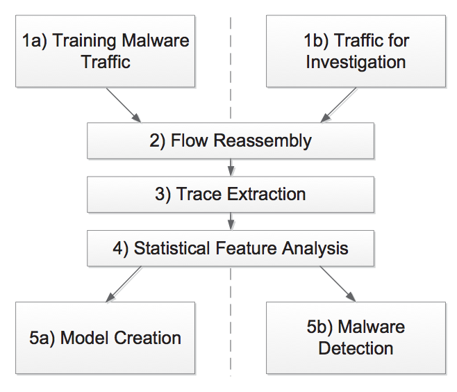
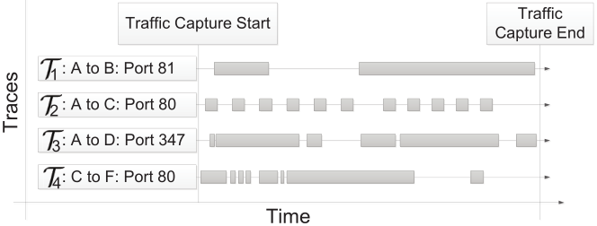

# BotFinder: Finding Bots in Network Traffic Without Deep Packet Inspection

<!-- TOC -->

- [背景知识与启发](#%E8%83%8C%E6%99%AF%E7%9F%A5%E8%AF%86%E4%B8%8E%E5%90%AF%E5%8F%91)
- [论文目标与贡献](#%E8%AE%BA%E6%96%87%E7%9B%AE%E6%A0%87%E4%B8%8E%E8%B4%A1%E7%8C%AE)
- [数据来源](#%E6%95%B0%E6%8D%AE%E6%9D%A5%E6%BA%90)
- [BotFinder](#botfinder)
    - [符号定义](#%E7%AC%A6%E5%8F%B7%E5%AE%9A%E4%B9%89)
    - [输入数据处理](#%E8%BE%93%E5%85%A5%E6%95%B0%E6%8D%AE%E5%A4%84%E7%90%86)
    - [Flow Reassembly](#flow-reassembly)
    - [Trace Extraction](#trace-extraction)
    - [统计特征分析](#%E7%BB%9F%E8%AE%A1%E7%89%B9%E5%BE%81%E5%88%86%E6%9E%90)
    - [模型创建（训练）](#%E6%A8%A1%E5%9E%8B%E5%88%9B%E5%BB%BA%EF%BC%88%E8%AE%AD%E7%BB%83%EF%BC%89)
    - [恶意软件检测](#%E6%81%B6%E6%84%8F%E8%BD%AF%E4%BB%B6%E6%A3%80%E6%B5%8B)
- [僵尸机器人演进](#%E5%83%B5%E5%B0%B8%E6%9C%BA%E5%99%A8%E4%BA%BA%E6%BC%94%E8%BF%9B)
    - [僵尸网络的策略](#%E5%83%B5%E5%B0%B8%E7%BD%91%E7%BB%9C%E7%9A%84%E7%AD%96%E7%95%A5)
    - [僵尸网络的成本](#%E5%83%B5%E5%B0%B8%E7%BD%91%E7%BB%9C%E7%9A%84%E6%88%90%E6%9C%AC)
    - [BotFinder 检测失败的可能原因](#botfinder-%E6%A3%80%E6%B5%8B%E5%A4%B1%E8%B4%A5%E7%9A%84%E5%8F%AF%E8%83%BD%E5%8E%9F%E5%9B%A0)
- [Reference](#reference)

<!-- /TOC -->

## 背景知识与启发

* 三个核心设计目标
    * 能够检测单个机器人感染
    * 只依靠高层次/网络流量提供的信息
        * 不检查载荷
        * 抵御加密通信
        * 数据信息容易获得
    * 对静默的机器人也适用
        * 窃取敏感数据
        * 没有“嘈杂”的行为
            * 垃圾邮件
            * DoS
* 观测到的现象
    * C&C 连接遵循一定的模式
    * 僵尸机器人向 C&C 发送相似的数据
    * 以相似的方式将信息上传到 C&C
    * 与 C&C 的通信时间模式有规律可循
* 在可控的环境中运行僵尸程序，即可学习到僵尸程序的活动模式

## 论文目标与贡献

* 观测不同僵尸网络家族的 C&C 流量呈现出的规律
* 使用机器学习的方法，自动生成僵尸检测模型
* BotFinder 原型机
    * 一个通过监视网络流量，来检测单个受感染宿主的系统

## 数据来源

* 2011年6月的30天之内，在 Anubis 上采集到的活跃的恶意软件样本
* 每个僵尸家族平均32个样本

## BotFinder

### 符号定义

* $$\tau$$, trace ,两个网络端点间数据流动的时间序列
* $$M$$,模型
* $$\tau_M$$, 模型 $$M$$ ， trace $$\tau$$ 的分数
* $$q_{cluster}$$, 质量评级

### 输入数据处理

* 所有网络流量
* 扫描流量，通过：
    * VirusTotal
    * Anubis
* 容忍杂讯

### Flow Reassembly

* 依照 NetFlow 汇总数据

### Trace Extraction

* $$|\tau|_{min}$$，最少通信次数 （经验值 10 到 50）
* 宿主与 C&C 服务器之间的多次通信组成了命令与控制通信
* 通过两种方法，过滤流量，并识别相关的流量 trace
    * 白名单
    * 第三方信息

### 统计特征分析

* 一个 trace 中两个子序列的启动时间的平均时间间隔
    * Botmaster 必须确保所有的机器人在他的控制之下
    * 通信不遵循 push 模式
        * 宿主可能位于 NAT 内
        * 未在 C&C 注册
    * 通信有固定的时间间隔，并且呈现出宽松的周期性
* 平均通信持续时间
    * 期望持续时间是相似的
* 传送到源的平均字节数
* 传送到目的的平均字节数
* 对数据流起始时间做快速傅立叶变换（FFT）
    * 确定通信的基本频率

### 模型创建（训练）

* 为每个特征分别聚类
    * 恶意软件的特征是不相关的
* 丢弃小且多样性高的集合(聚类评级较低)
* CLUES 算法
    * 允许无参数聚类
    * 比 K-means 更好
* 聚类质量评级
    * 大且数值相近的集群更好
    * $$q_{cluster} = exp(-\beta \frac{SD}{Avg})$$
        * $$\beta = 2.5$$ （经验值）

### 恶意软件检测

* 将 trace 的每个特征与相应模型的集群进行匹配
* $$\tau$$ 命中上了 $$M$$ 的一个特征
* 把 $$q_{cluster} \cdot exp(-\beta \frac{SD_{trace}}{Avg_{trace}})$$ 加到 $$\tau_M$$
    * $$\beta = 2.5$$ （经验值）
* 为每个模型维护一个 $$\tau_M$$
* 把最高的 $$\tau_M$$ 与阈值 $$a$$ 进行比较
* 允许设定命中特征数量的最小值, $$h$$

## 僵尸机器人演进

### 僵尸网络的策略

* 行为更加随机
    * 当僵尸网络的行为 100% 随机时，BotFinder 的检测率保持在 60%
* 时间间隔更长
    * 快速傅立叶变换能够克服
* C&C 服务器频繁变化
    * BotFinder 无法构建 $$|\tau|_{min} = 50$$ 的 trace
        * 没有观测到如此高的 C&C 服务器变化 (IP flux)
    * 可以在步骤 4 之前添加一步预处理
        * 合并两个子 traces ：$$\tau_A$$ 和 $$\tau_B$$
        * 两个影响因素
            * $$\tau_{AB}$$ 的标准差要比二者中最小的还小
            * $$\tau_{AB}$$ 的 $$q_{cluster}$$ 要高于阈值
* P2P 僵尸网络
* 僵尸网路模拟正常通信

### 僵尸网络的成本

* C&C 和宿主需要更新僵尸网络通信拓扑信息
* 增加僵尸网络运营商的成本，降低僵尸网络的稳定性和性能

### BotFinder 检测失败的可能原因

* 僵尸网络通信明显随机化
* 大幅增加通信间隔，导致 BotFinder 必须捕捉长时间的 trace
* 通信源和目的加入多变的的通信开销
* 非常频繁地更换 C&C 服务器
* 每次 C&C 服务器更改后使用完全不同的通信模式

## Reference

* BotFinder: Finding Bots in Network Traffic Without Deep Packet Inspection
* CS 259D Lecture 2
