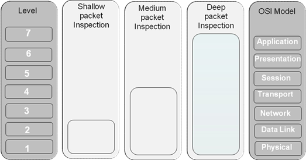
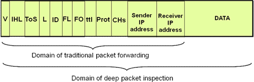

# 深度包检测和多态技术

<!-- TOC -->

- [数据包检测](#数据包检测)
    - [数据包检测的深度](#数据包检测的深度)
    - [深度包检测（Deep Packet Inspection，DPI）](#深度包检测deep-packet-inspectiondpi)
- [逃避深度包检测](#逃避深度包检测)
- [参考资料](#参考资料)

<!-- /TOC -->

## 数据包检测

### 数据包检测的深度

### 深度包检测（Deep Packet Inspection，DPI）

* 绝大多数网络流量不能依照端口进行正确的分类（传统的数据包检测）

* 深度包检测：检测数据包的载荷，并根据存在于载荷中的特定模式处理数据包
* 应用
    * 网络安全
        * 恶意网址/网站
        * 恶意载荷
        * 内部数据丢失预防(Data Loss Prevention，DLP)
        * 特征检测
    * 带宽管理
    * 用户画像/广告注入
    * 流量的计费和计量
    * 信息管理和过滤
    * 版权保护
    * 政府监控及审查
* 面临的挑战
    * 操作系统和硬件设备的性能瓶颈
    * 难以扩展到高速网络
    * 签名特征量大且易变
    * 流量加密
    * 载荷多态技术
    * 隐私和法律问题

## 逃避深度包检测

* 流量混淆
* 加密和隧道技术
* 多态技术
    * 将有意义的指令与“无作为”的指令交错
    * 使用不同的指令来实现相同的结果
    * 对每一个版本的多态解码器的寄存器集进行洗牌
    * 对多态解码器正在处理的部分解密然后再加密
    * 使用多层解码器

## 参考资料

* [What is Deep Packet Inspection ?](https://computersecuritypgp.blogspot.com/2016/04/deep-packet-inspection.html)
* [Deep Packet Inspection : The impact of a new technology on Internet regulation](http://globalgovernanceprogramme.eui.eu/wp-content/uploads/2013/01/Milton-Mueller.pdf)
* Deep packet inspection tools and techniques in commodity platforms: Challenges and trends
* [White paper on Deep Packet Inspection](http://tec.gov.in/pdf/Studypaper/White%20paper%20on%20DPI.pdf)
