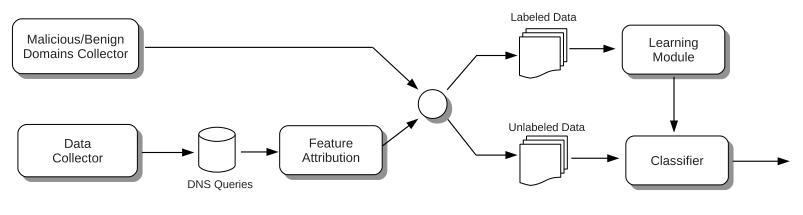

# EXPOSURE: Finding Malicious Domains Using Passive DNS Analysis

<!-- TOC -->

- [背景知识与启发](#%E8%83%8C%E6%99%AF%E7%9F%A5%E8%AF%86%E4%B8%8E%E5%90%AF%E5%8F%91)
- [论文目标与贡献](#%E8%AE%BA%E6%96%87%E7%9B%AE%E6%A0%87%E4%B8%8E%E8%B4%A1%E7%8C%AE)
- [EXPOSURE 概述](#exposure-%E6%A6%82%E8%BF%B0)
- [收集训练数据](#%E6%94%B6%E9%9B%86%E8%AE%AD%E7%BB%83%E6%95%B0%E6%8D%AE)
- [特征](#%E7%89%B9%E5%BE%81)
    - [基于时间的特征](#%E5%9F%BA%E4%BA%8E%E6%97%B6%E9%97%B4%E7%9A%84%E7%89%B9%E5%BE%81)
        - [变化点检测 （Change Point Detection， CPD）](#%E5%8F%98%E5%8C%96%E7%82%B9%E6%A3%80%E6%B5%8B-%EF%BC%88change-point-detection%EF%BC%8C-cpd%EF%BC%89)
        - [检测每日近似行为](#%E6%A3%80%E6%B5%8B%E6%AF%8F%E6%97%A5%E8%BF%91%E4%BC%BC%E8%A1%8C%E4%B8%BA)
    - [基于 DNS 应答的特征](#%E5%9F%BA%E4%BA%8E-dns-%E5%BA%94%E7%AD%94%E7%9A%84%E7%89%B9%E5%BE%81)
    - [基于 TTL 的特征](#%E5%9F%BA%E4%BA%8E-ttl-%E7%9A%84%E7%89%B9%E5%BE%81)
    - [基于域名的特征](#%E5%9F%BA%E4%BA%8E%E5%9F%9F%E5%90%8D%E7%9A%84%E7%89%B9%E5%BE%81)
- [训练](#%E8%AE%AD%E7%BB%83)
    - [分类器](#%E5%88%86%E7%B1%BB%E5%99%A8)
        - [C4.5 决策树算法](#c45-%E5%86%B3%E7%AD%96%E6%A0%91%E7%AE%97%E6%B3%95)
- [Evaluation](#evaluation)
- [局限 (逃避检测)](#%E5%B1%80%E9%99%90-%E9%80%83%E9%81%BF%E6%A3%80%E6%B5%8B)
- [参考资料](#%E5%8F%82%E8%80%83%E8%B5%84%E6%96%99)

<!-- /TOC -->

## 背景知识与启发

* 典型 Internet 攻击
    * 僵尸网络
    * 钓鱼
* 攻击者和企业一样面临同样的工程技术挑战
    * 实现可靠和灵活的服务器基础架构
    * DNS 的优势
        * 变换 IP
        * 隐藏关键服务器
        * 灵活地迁移服务器
        * 服务器比 IP 更“容错”

## 论文目标与贡献

* 检测恶意域名
    * 被动式
    * 没有先验知识
* 15 个行为特征
    * 9 个新特征

## EXPOSURE 概述

* 五个主要部分
    * 数据收集
    * 特征提取
    * 恶意和良性域名收集（有标签数据）
        * 恶意
        * 良性
    * 学习模块
    * 分类
        * 给为标记的域名分类

## 收集训练数据

* 来自（Security Information Exchange，SIE）的 DNS 流量
    * 来自北美和欧洲的权威名称服务器的响应数据
    * 2.5个月
    * 超过1000亿 DNS 查询（平均每分钟100万次查询）
    * 480万个不同的域名
    * 过滤
        * Alexa 排名前1000（减少20%）
        * 超过1年的域名（减少50%以上）
* 恶意域名
    * 3500个域名
    * 类型
        * 僵尸网络 C&C
        * 驱动下载网站
        * 网络钓鱼/诈骗页面
    * 示例
        * [Malware Domain Block List](http://www.malwaredomains.com/)
        * Zeus 屏蔽列表
* 良性的域名
    * 3000个域名
    * 示例
        * Alexa top 1000

## 特征

* F1: 基于时间的特征
    * 存活时间短
    * 每日相似程度
    * 模式重复
    * 访问比例
* F2: 基于 DNS 应答的特征
    * 不同 IP 地址的数量
    * 不同的 IP 地址所在国家的数量
    * 共享域名的数量
    * 反向 DNS 查询结果
* F3: 基于 TTL 的特征
    * TTL 的平均数
    * TTL 标准差
    * 不同 TTL 值的数量
    * TTL 的变化次数
    * 使用特定的 TTL 范围的百分比
* F4: 基于域名的特征
    * 数字字符的百分比
    * 最长有意义子串（longest meaningful substring，LMS）长度的百分比

### 基于时间的特征

* 启发
    * 恶意域名的请求数量往往急增急减
* 分析方法
    * 将时段分入为固定长度的间隔
    * 统计查询次数
* 全局范围
    * 存活时间短
        * DGA（域生成算法，domain generation algorithm）生成域名
    * 改变行为
* 本地范围
    * 主要思路
        * 放大域名的生命周期
        * 研究行为特征
    * 每日相似程度
        * 每日以相同的时间间隔增加或减少请求数
    * 模式重复
        * 变化点检测（change point detection，CPD）
        * 变化数量
        * 检测到的变化的持续时间的标准差
    * 访问比例
        * 空闲还是热门

#### 变化点检测 （Change Point Detection， CPD）

* 运作于时间序列之上
* 目标是找到那些数据值突然改变的点
* 检测突变
    * 对每个域名的时间序列
        * $$P(t)$$，在小时 $$t$$ 时的请求数量，并由最大值做标准化
        * 迭代时间间隔 $$t = 3600s$$
        * $$P^-(t)$$, 过去 $$8$$ 个时间间隔的平均数
        * $$P^+(t)$$, 未来 $$8$$ 个时间间隔的平均数
        * $$d(t) = |P^+(t) - P^-(t)|$$
    * 对 $$d(t)$$ 做累加求和
        * 对于检测时间 $$t$$, 当 $$d(t)$$ 够大并且是 $$local\_max$$
        * $$CUSUM(t) = Max\{0, CUSUM(t-1) + d(t) - local\_max\}$$
        * 如果 $$CUSUM(t) > cusum\_max$$，就把 $$t$$ 作为监测点报告

#### 检测每日近似行为

* 计算所有时间序列对的距离
    * 通过平均值和标准差对时间序列做标准化
    * 计算欧几里得距离
* $$d_{ij}$$，第$$i$$天和第$$j$$天之间的欧几里得距离
* $$D$$，$$d_{ij}$$所有只的平均数

### 基于 DNS 应答的特征

* 域名映射到多个 IP 地址，IP 地址被不同的域名共享
* 不同 IP 地址的数量
    * 在实验期间解析的域名
* 不同的 IP 地址所在国家的数量
* 共用 IP 的域名数量
    * 网络托管提供商的共用 IP 量可能很多
* 反向 DNS 查询结果
    * 通过在Google前3名搜索结果中，反向查询 DNS，以此来减少误报

### 基于 TTL 的特征

* TTL（Time To Live，生存时间）：DNS响应缓存的时长
    * 建议时长1-5天
* 启发
    * 恶意网络复杂的基础设施会频繁更改 TTL
    * 设置的 TTL 值较低的主机不太可靠
* TTL 平均值
    * 高效的系统
        * TTL 值低
        * 轮询调度 DNS
        * 例如：CDN，Fast Flux 僵尸网络
* TTL 标准差
    * 受感染的家庭计算机（动态 IP）分配的 TTL 要比受感染的服务器（静态 IP）短
* 不同的TTL值的数量
* TTL 变化次数
    * 恶意域名变化次数较高
* 特定的 TTL 区间的使用占比
    * 考虑一下范围：$$[0,1), [1,10), [10,100), [100,300), [300,900), [900, inf)$$
    * 恶意域名的区间在 $$[0, 100)$$

### 基于域名的特征

* 启发
    * 易于记忆的名字
        * 对于正常的服务很重要
        * DNS 的主要目的
    * 对攻击者而言不重要（如，通过 DGA 生成）
* 数字字符与名字长度的比例
* 最长有意义子串（longest meaningful substring，LMS）的长度与域名长度的比例
    * 在谷歌查询并把匹配数与特定的阈值相比较
* 仅在二级域名（second-level domains，SLD）上使用特征
    * `x.y.server.com` $$\rightarrow$$ `server.com`
* 其他可能的功能：域名的熵
    * DGA生成的域名比人为设定的更随机

## 训练

* 训练周期
    * 初始期限为7天（基于时间的特征）
    * 每天重新训练

### 分类器

* J48 决策树
    * C4.5
* 特征选择
    * 错误分类的样本的百分比

#### C4.5 决策树算法

* 检查基本情况
* 对于每个特征
    * 计算特征的标准化信息增益
* 以最高增益分割属性
* 递归
* 标准化的信息增益 = 类的熵值差异

## Evaluation

* 评估检测率
    * `malwareurls.com` 提供了569个域名
        * 在受监视的网路中有216个域名被查询
    * 5个域名查询次数少于20
        * 已过滤
    * 211个域名检测到恶意行为
    * 检测率：98%
* 评估误报率
    * 过滤两个半月内查询次数少于20的域名（剩余300,000个域名）
    * 17,686被检测为恶意（5.9%）
    * 域名无标记
        * 很难手动验证
    * 验证
        * Google搜索
        * 众所周知的垃圾邮件列表
        * 诺顿安全网站
        * McAfee Site Advisor
    * 误报率：7.9%

## 局限 (逃避检测)

* 攻击者事先知道关于 EXPOSURE 的信息
* 在所有受感染的宿主上设置统一的 TTL 值
    * 降低攻击者的设施可靠性
* 减少恶意域名的 DNS 查询次数
    * 执行起来并非易事
    * 攻击效果受影响
    * 要协调到高度一致

## 参考资料

* EXPOSURE: Finding Malicious Domains Using Passive DNS Analysis (2011)
* CS 259D Lecture 3
