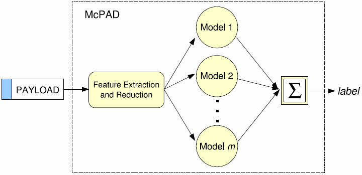

# McPAD : A Multiple Classifier System for Accurate Payload-based Anomaly Detection

<!-- TOC -->

- [本文目标和贡献](#本文目标和贡献)
- [模型体系](#模型体系)
    - [单分类 SVM](#单分类-svm)
    - [融合规则](#融合规则)
    - [McPAD](#mcpad)
    - [攻击手段](#攻击手段)
- [数据](#数据)
- [局限性](#局限性)
- [参考资料和推荐阅读](#参考资料和推荐阅读)

<!-- /TOC -->

## 本文目标和贡献

* 提高 $$2$$-grams 方法

## 模型体系

### 单分类 SVM

* 单分类 SVM 简介：[Introduction to One-class Support Vector Machines](http://rvlasveld.github.io/blog/2013/07/12/introduction-to-one-class-support-vector-machines/)

### 融合规则

* 结合所有的单分类 SVM
* 最小值，最大值，平均值，乘积，多数投票
* 不同的模型应用不同的后验概率，$$p_i(\mathrm{x}|\omega)$$
* 假设异常值分布均匀，则可以将这些规则转化为条件概率

### McPAD

* 特征提取
    * $$2_v$$-grams，$$65536$$ 个维度
        * $$n$$-grams，$$256^n$$ 个维度
        * 当 $$v = 0$$时，等效于 $$2$$-gram 模型（版的PAYL）
        * 滑动窗口大小，$$v + 2$$
    * 没有自动的从 $$2_v$$-grams 得到 $$2_(v-1)$$-grams，$$2_(v-2)$$-grams 的方法 
        * 不同于 $$n$$-grams
        * 不同的 $$v$$ 导致不同的载荷结构信息
* 减少特征
    * 特征聚类算法

### 攻击手段

* 常见攻击
* Shell-code 攻击
* CLET 生成攻击
* 多态混合攻击（Polymorphic Blending Attack，PBA）

## 数据

* 白样本
    * DARPA
    * GATECH
* 黑样本
    * 公开的非多态 HTTP 攻击
    * 创建多态HTTP攻击
    * 难以收集到足够多的攻击流量

## 局限性

* [FP率较高](http://www.cse.chalmers.se/edu/course/DAT285B/SLIDESNOTES/NGramPresentation.pptx)

## 参考资料和推荐阅读

* McPAD : A Multiple Classifier System for Accurate Payload-based Anomaly Detection, Perdisci et al, 2009
* HMMPayl: An intrusion detection system based on Hidden Markov Models, Ariu, 2011
* [McPAD and HMMPayl Two Multiple-Classifier Payload-based Anomaly Detectors](http://pralab.diee.unica.it/en/HMMPayl_and_McPAD)
* CS 259D Lecture 15
