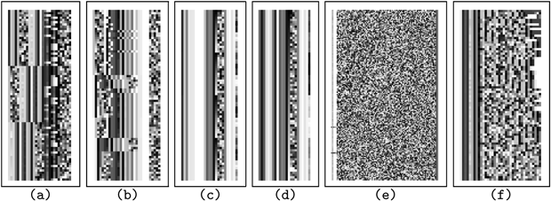

# On the Infeasibility of Modeling Polymorphic Shellcode

<!-- TOC -->

- [Goal](#goal)
- [Shellcode](#shellcode)
    - [Decoder](#decoder)
- [Related work: Signature matching](#related-work-signature-matching)
- [Problem definition](#problem-definition)
- [Polymorphic Engine Analysis](#polymorphic-engine-analysis)
    - [Measures](#measures)
    - [Spectral Image](#spectral-image)
    - [Minimum Euclidian distance](#minimum-euclidian-distance)
    - [Variation strength](#variation-strength)
    - [Propagation strength](#propagation-strength)
    - [Overall strength](#overall-strength)
- [Hybrid Engine: Combining Polymorphism and Blending](#hybrid-engine-combining-polymorphism-and-blending)
- [Reference](#reference)

<!-- /TOC -->

## Goal

* Describe describes shellcode and code obfuscation techniques
* Measure the strengths of polymorphic engines
* Introduce a hybrid engine

## Shellcode

* Traditional shellcode structure
    * [nop][**payload**][retaddr]
* Encrypted shellcode structure
    * [nop][**decoder**][**encpayload**][retaddr]
* Modern obfuscation technique
    * Automatically re-write code
        * Hard(NP-complete) to decompose to graph
    * Code-obfuscation
        * Encrypt
        * Dynamically decrypt at runtime
        * Remain code obfuscated at runtime

### Decoder

* Look for decoder rather than payload
* **How well the decoder can be hidden**
    * Rearranging and randomizing the order of the individual ciphers components
    * Randomly chosen keys
    * Insert junk instructions
* Decoder detector
    * Modification operation
        * `add`, `sub`, `xor`, etc.
    * Loop component
        * `jmpz`
    * Maintenance operations
        * Clear register
        * Multiple cipher operation
        * Calculate the location of the executable

## Related work: Signature matching

* String-based signatures
    * Snort
* Detection heuristics
    * Frequency of various packet types
* Identification of NOP sled
* Signature from the actual actual exploit code
* Statistical measures of packet content

## Problem definition

* Given n bytes, there exist 256n possible strings
* x86 code of length n is a subspace
* How difficult is it to model this subspace?

## Polymorphic Engine Analysis

### Measures

* Spectral image
* Minimum Euclidian distance
* Variation strength
* Propagation strength
* Overall strength

###  Spectral Image

* D decoders of length N
* Compile into D*N matrix
* Display matrix as image

### Minimum Euclidian distance

* Intuition: Decoders can shift order of operations
* String x as point in n-dim Euclidian space
    * Example: "ab" -> (97,98)
* Minimum Euclidian Distance: minimum normalized distance between two points under arbitrary byte-level rotations

$$\delta(\textbf{x}, \textbf{y}) = \min_{1 \leq r \leq n}\{\frac{\parallel \textbf{x} = rot(\textbf{y}, r) \parallel}{\parallel \textbf{x} \parallel + \parallel \textbf{y} \parallel}\}$$

### Variation strength

* Magnitude of the space covered by span of points in n-space corresponding to detectors
* Decoders $$x_1, x_2, ..., x_N$$ in n-space
* $$\lambda_1, \lambda_2, ..., \lambda_n$$ eigenvalues of covariance matrix
* Variation strength:

$$\Psi(\text{engine}) = \frac{1}{d}\sum_{i = 1}^{d}{\sqrt{\lambda_i}}$$

### Propagation strength

* Efficacy in making sample pairs different
* Consider fully connected graph with decoders as nodes
* Edge weight = minimum Euclidian distance
* Propagation strength = average edge weight
* $$\eta = \#$$ salient bytes in samples
* p(.) = prior (default: p(.) = 1)

$$\Phi(engine) = (1 - \frac{\eta}{n})\int\int p(\delta(x, y))\delta(x, y)dxdy$$

### Overall strength

* For a polymorphic engine

$$\Pi(\text{engine}) = \Phi(\text{engine}) \cdot \Psi(\text{engine})$$

## Hybrid Engine: Combining Polymorphism and Blending

* CLET: byte distribution blending
* ADMutate: Polymorphism
    * Random looking decoder, recursive NOP sled
* Combine CLET and ADMutate
    * Blend in with normal traffic
    * Blending bytes can be randomly permuted
    * RETADDR can be added with a random offset
    * 4-byte salient artifact too small to use as a signature
    * Essentially impossible to model

## Reference

* On the Infeasibility of Modeling Polymorphic Shellcode, Song et al, 2007
* CS 259D Session 14
