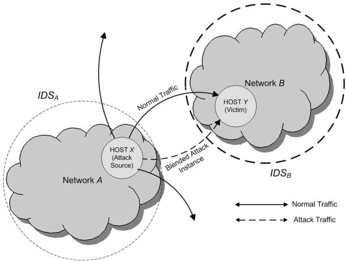

# Polymorphic Blending Attacks

<!-- TOC -->

- [本文目标](#本文目标)
- [相关工作](#相关工作)
- [混合攻击](#混合攻击)
    - [多态混合攻击方案](#多态混合攻击方案)
    - [多态性攻击](#多态性攻击)
        - [多态性](#多态性)
        - [多态攻击的三部分](#多态攻击的三部分)
        - [多态攻击检测](#多态攻击检测)
    - [多态混合攻击（Polymorphic Blending Attacks， PBA）](#多态混合攻击polymorphic-blending-attacks-pba)
    - [多态混合攻击步骤](#多态混合攻击步骤)
        - [第一步：学得 IDS 正常的轮廓数据](#第一步学得-ids-正常的轮廓数据)
        - [第二步：攻击体加密](#第二步攻击体加密)
        - [第三步：生成多态解密器](#第三步生成多态解密器)
    - [攻击数据包设计](#攻击数据包设计)
- [逃避 PAYL](#逃避-payl)
    - [逃避 1-gram](#逃避-1-gram)
        - [填充](#填充)
        - [替换](#替换)
    - [逃避 2-gram](#逃避-2-gram)
- [实验设置](#实验设置)
    - [攻击向量](#攻击向量)
    - [数据集](#数据集)
- [评估](#评估)
    - [PAYL 训练](#payl-训练)
    - [传统多态攻击（CLET）](#传统多态攻击clet)
    - [多态混合攻击](#多态混合攻击)
        - [仿真轮廓数据](#仿真轮廓数据)
        - [1-gram 和 2-gram 攻击](#1-gram-和-2-gram-攻击)
- [IDS的对策](#ids的对策)
- [限制性和改进](#限制性和改进)
- [参考资料](#参考资料)

<!-- /TOC -->

## 本文目标

* 研究多态混合攻击
* 为什么基于载荷统计的网络异常入侵检测系统失效
* 案例研究：1-gram 和 2-gram PAYL

## 相关工作

* 多态攻击
    * IP/TCP 变换
    * Mutation exploits（Vigna et al.）
    * Fragroute, Whisker, AGENT, Mistfall, tPE, EXPO, DINA, ADMutate, PHATBOT, JempiScodes
    * CLET
* 防御多态攻击
    * 寻找可执行代码（Toth et al.）
    * 在多个代码实例中寻找相似的结构（Kruegel et al.）
    * 在多个代码实例中寻找常见的字串（Polygraph）
        * 被噪音攻击攻破
    * 寻找任何已知漏洞的 exploit（Shield）
    * 寻找指令语义，检测已知的代码转换（Cristodorescu et al.）
    * 检测异常的系统调用序列 （Forest et al.）
        * 可以通过模拟攻击攻破
        * 新的方法是用堆栈信息，但同样可以被攻破
    * 基于负载的异常检测
        * 使用长度，字符分布，概率语法和令牌来模拟 HTTP 流量（Kruegel et al.）
        * 分端口记录流量的字节频率( PAYL )

## 混合攻击

### 多态混合攻击方案

")

### 多态性攻击

#### 多态性

* 将数据包伪装成正常流量
* 改变数据包的内容使其看起来彼此互不相同
* Exploit 代码并不常见
* **使得攻击看起来互不相同，但并不常见**

#### 多态攻击的三部分

* 攻击向量
    * 分为可变部分和不可变部分
    * 如果不可变部分的体积小且混杂在正常流量中
        * 可能导致 IDS 误报率上升
* 攻击体（shellcode）
    * 寄存器 shuffling
    * 等效指令替换
    * 指令重排
    * 插入垃圾指令
    * 加密
* 多态解码器
    * Shellcode 解密
    * 混淆解码器代码

#### 多态攻击检测

* Exploit 代码或其他输入数据包含一些在正常的数据包中少见的低频字符
* **这种偏差可以被检测出来**

### 多态混合攻击（Polymorphic Blending Attacks， PBA）

* 使得攻击看起来互不相同
* **按照合法的流量，调整它们的字节频率（看起来像正常）**

* 实际攻击场景假设
    * 攻击者入侵了网络 A 中的主机 X，目标主机是网络 B 中的 Y， 网络 A 和 B 互相通信
    *攻击者对监控被受害的主机网络的 IDSB 有所了解
    * 网络 B 使用基于载荷统计的 IDS（例如 PAYL）
    * IDSB 可以调整设定的阈值从而得到调控误报率
        * 攻击者不知道 IDSB 设置的具体阈值
        * 攻击者会估计一个普遍适用的误报率，漏报率
* 攻击者的行动
    * 控制主机 X
    * 观测从 X 到 Y 的正常通信
    * 使用和 IDSB 相同的技术建立正常的流量轮廓数据（*仿真轮廓数据*）
    * 创造变异的实例来匹配仿真轮廓数据
    * 如果 IDSB 无法分辨改变过的数据包，则攻击者攻击成功
* 攻击者的权衡
    * 攻击数据大小
        * 监控网络上数据流的大小
    * 处理速度
        * 在时间和空间的利用上应该是划算的
        * 过高的资源利用可能会导致本地的 IDS（例如，IDSA 或者 基于主机的 IDS）发起警报

### 多态混合攻击步骤

#### 第一步：学得 IDS 正常的轮廓数据

* 嗅探网络流量
* 生成仿真轮廓数据
* 捕获更多的正常通信数据，能生成更正常的轮廓数据
* 配置数据包括
    * 数据包平均大小，最大值
    * 数据包的速率
    * 字节频率分布
    * Tokens 的偏移范围

#### 第二步：攻击体加密

* 匹配正常的配置数据
    * 替换每一个数据
    * 填充一些垃圾数据
* 可逆操作
* 生成适当的替换表

#### 第三步：生成多态解密器

* 移除填充数据
* 替换回原有字符
* 解密器不加密，但应被变化过

### 攻击数据包设计

* 找到类似于攻击数据包的正常配置文件
    * 字符频率（替换表）
        * 如果新旧替代表之间没有显著差异，则用新换旧
    * 数据包长度
        * 比攻击包长
        * 备用方案：将攻击体分成多个小包

## 逃避 PAYL

### 逃避 1-gram

* **最小化最大的频率差距**

#### 填充

* $$\hat{\omega}$$，填充前的替换过的攻击体
* $$\acute{\omega}$$，填充后的替换过的攻击体
* $$\|\omega\|$$，$$\omega$$ 的长度
* $$i$$，字符的次序
* $$x$$，字符
    * $$x_i$$，第 $$i$$ 个字符
* $$\lambda$$，出现的次数
    * $$\lambda_i$$，$$x_i$$ 出现的次数
* $$\|\acute{\omega}\| = \|\hat{\omega}\| + \sum_{i=1}^n{\lambda_i}$$
* $$f(x_i)$$，在正常流量中 $$x_i$$ 的相对频率
* $$\hat{f}(x_i)$$，在替换过的攻击流量中 $$x_i$$ 的相对频率
* $$\lambda_i = \|\acute{\omega}\|f(x_i) - \|\hat{\omega}\|\hat{f}(x_i)$$
* 因为有些字符 $$f(x_i) < \hat{f}(x_i)$$
    * **频率最高的字符不需要填充** 
* 设 $$\delta = \max{(\hat{f}(x_i) / f(x_i))}$$ 为超频字符的最大值
    * $$\lambda_i = \|\hat{\omega}\|(\delta f(x_i) - \hat{f}(x_i))$$

#### 替换
    
* 为了最小化填充量，我们需要最小化 $$\delta$$
* 情形 1：攻击字符比合法字符少
    * 生成一对多映射的贪心算法
    * 按照攻击和合法流量的字符频率
    * 按降序匹配字符
    * 剩余的合法字符分配给频率最高的攻击字符使其频率下降
* 情形 2：攻击字符比合法字符少
    * 生成多对一映射的贪心算法
    *构造哈夫曼树，其中子叶子节点是攻击流量中的字符，迭代连接频率最小的节点，这样使得最高频率的字符有最短的路径长度（编码长度）
    * 为保持原始的合法字符频率，我们必须为边挑选标签（非随机）
        * 按权重排序树中的顶点
        * 按频率排序合法字符
        * 为最高权重顶点分配最高频率字符
        * 移除该顶点，并从字符频率中减去被分配走的部分，以便后续处理
        * 重新按频率排序字符

### 逃避 2-gram

* 必须匹配所有的2-字节对
* 用 FSM 的状态表示有效的 2-grams
* 一种简单的方法，枚举SFM中所有的合法路径，把攻击字符随机映射到路径上，但这样会导致较大的代码体积
    * 按照信息熵能获得更好的映射，例如，把常见字符映射到短路经上
* 另一个方法：尝试找到单个字符对应的映射，这样 2-grams 映射也得到了匹配
    * 在不违反以有的映射的情况下，使用贪心算法，排序合法和攻击字符的 2-grams 并进行匹配
* 由贪心算法生成填充数据，以便匹配目标映射

## 实验设置

### 攻击向量

* Windows Media Services (MS03-022)
    * 通过记录用户请求来实现攻击
* 攻击向量的大小为 99 字节
    * 在 HTTP 请求开始时出现
* 需要发送大约 10KB 的数据以导致缓冲区溢出
* 攻击体打开一个 TCP 链接 并且发送注册文件
* 攻击体的大小是 558B 并且包含 109 个唯一的字符
* 攻击被分装在多个数据包
    * 每个数据包都有解码器
* 如果封装后的混合数据包不足 10KB，则发送一些正常数据包

### 数据集

* 捕获了 15 天的 HTTP 流量
    * 来自一个部门
    * 14天的通信数据用来训练 IDS（4,356,565 个数据包，1.9GB）
    * 攻击者用最后一天的数据学习字符特征分布
    * 只使用不包含已知攻击的 TCP 数据包
* IDS 为数据包分长度构建轮廓数据
* 为攻击选择三个常见的数据包大小

## 评估

### PAYL 训练

* PAYL 训练时间随着训练数据的增大而增加，因为新数据包包含更多的不重复的 n-grams

### 传统多态攻击（CLET）

* 测试对 PAYL 发起的由 CLET 生成的攻击
    * CLET 仅添加填充以匹配字节频率
    * 其余的对 PAYL 发起攻击的多态引擎比 CLET 表现更差
    * 只有当所有数据包的异常分数高于阈值时，CLET 才能避免被 PAYL 检测出来
    * 设置好阈值，1-gram 和 2-gram 版的 PAYL 都可以检测出所有攻击

### 多态混合攻击
    
#### 仿真轮廓数据

* 当两个数据包现有的轮廓数据没有明显改变时（用曼哈顿距离衡量），停止训练仿真轮廓数据

#### 1-gram 和 2-gram 攻击

* 对于 1-gram 攻击，使用一对一的编码表
* 对于 2-gram 攻击，使用单字节的编码方案
    * 测试两种替代方式
    * 全局替代
        * 为整个攻击体构建编码表
        * 用单个解码表解码整个数据流
    * 局部替代
        * 为数据报构建编码表
        * 一个数据包对应一个解码表
        * 填充数据的空间减少
    * 如果攻击字符比合法字符多，就是用不存在的字符
* 2-gram IDS 对攻击普遍给出了较高的分数，但也要为避免误报设置较高的阈值
    * 总体表现和 1-gram IDS 相似
    * IDS 开销更高
* 局部替代要优于全局替代

## IDS的对策

* IDS 模型
    * 更加复杂的模型
    * 混合更多模型
* 特征
    * 句法和语义信息
* 更高的硬件性能
* 衡量随机性

## 限制性和改进

* PAYL 是唯一的研究案例
* 对 PBA 的假设是否现实
* 探究适用于连续数据流的技术

## 参考资料

* Polymorphic Blending Attacks, Fogla et al, 2006
* [CDA6938 Special Topic:Research in Computer and Network Security (Spring 2007)](http://www.cs.ucf.edu/~czou/CDA6938/Polymorphic_blending_attacks_Himanshu_Pagey.ppt)
* [CIS 864 - Advanced Topics in Network Security - Spring 2007](https://www.eecis.udel.edu/~sunshine/courses/S07/CIS864/blend.ppt)
* Sergio Pastrana, Agustin Orfila, Juan E. Tapiador, Pedro Peris-Lopez, Randomized Anagram revisited, In Journal of Network and Computer Applications, Volume 41, 2014, Pages 182-196, ISSN 1084-8045, 
* CS 259D Lecture 14
