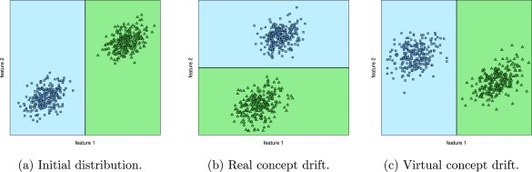
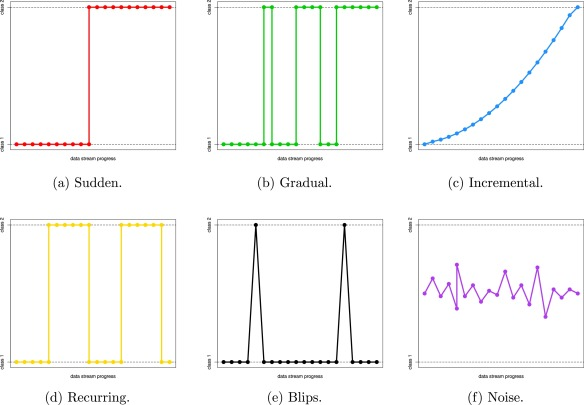
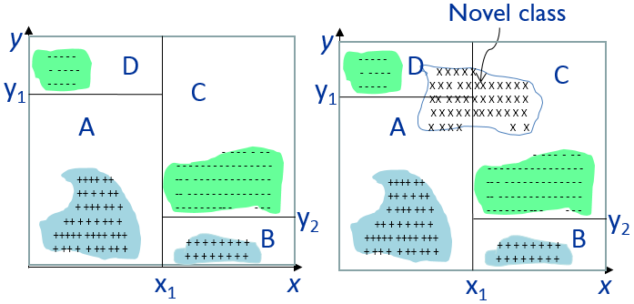
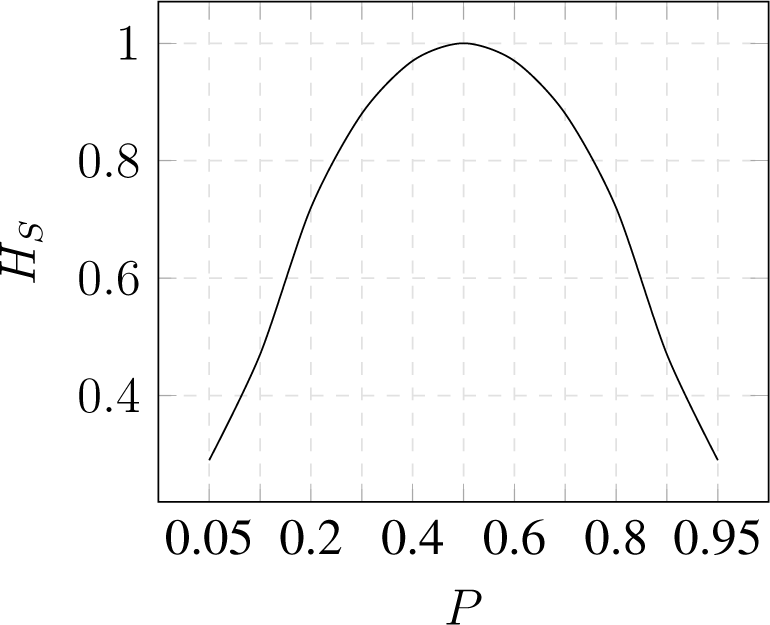
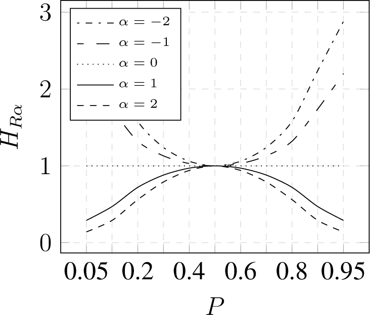
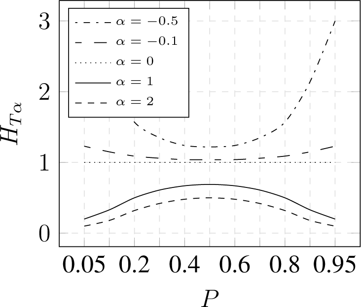

# 流数据和信息熵

<!-- TOC -->

- [流数据](#流数据)
    - [概念漂移](#概念漂移)
        - [漂移应对办法](#漂移应对办法)
    - [概念进化](#概念进化)
    - [评价标准](#评价标准)
- [数据处理](#数据处理)
    - [实例缩减](#实例缩减)
    - [降维](#降维)
    - [特征空间简化](#特征空间简化)
- [熵](#熵)
    - [香农熵](#香农熵)
    - [广义熵](#广义熵)
        - [Rényi 熵](#rényi-熵)
        - [Tsallis 熵](#tsallis-熵)
    - [通过二项分布来比较](#通过二项分布来比较)
- [参考资料和推荐阅读](#参考资料和推荐阅读)

<!-- /TOC -->

## 流数据

* 流数据，一个可能无边际（无限大），持续增长的数据集
    * 体积，流量，（多变）
        * 对于单个内存而言，太大
        * 对于单个 CPU 而言，太快
        * 对于单一对的机器学习系统而言，变数太多

| 流数据及处理方法                         | 传统数据及处理方法                       |
|------------------------------------------|------------------------------------------|
| 线上、实时处理                            | 离线处理                                 |
| 线性和次线性计算技术广泛应用             | 必要时可使用较高的空间和时间复杂度的技术 |
| 每个实例的访问次数和处理时间受限         | 限制条件较为宽松                         |
| 存储所有数据不可行                       | 存储数据是可行的                         |
| 存储统计数据，临时数据，或其他处理过的数据 | 可存储原始数据                           |
| 近似结果可以接受                         | 要求计算结果的准确度                     |
| 通常处理抽样数据                         | 通常处理每个数据项、记录                  |
| 统计特征随时间变化                       | 统计特征稳定                             |

### 概念漂移

* 概念漂移，数据的属性可能会随条件变化而变化
* 实例和特征的数量与相关性可能会因漂移而变化

* 对已学到的分类的边界的影响不同
    * 真概念漂移
    * 假概念漂移

* 漂移变化的类型
    * 突变
    * 渐变
    * 增量
    * 重复
    * 闪现
    * 噪音
    * 多类型混合

#### 漂移应对办法

* 概念漂移检测
    * 显式地处理概念漂移
    * 统计学标砖
        * 标准差
        * 预测误差
        * 实例分布
        * 稳定性
    * 两个处理阶段
        * 当漂移发生时，用最近的实例训练新的分类器
        * 当漂移比较严重时，用新的分类器替代旧的分类器
* 滑动窗口
    * 隐式地处理概念漂移
    * 窗口大小非常关键
* 在线学习
    * 每个对象只能被处理一次
* 集合学习

### 概念进化

* 数据中出现新的类别
* 解决办法
    * 设置半径和自适应阈值
    * 基尼系数
    * 多分类检测

### 评价标准

* 预测能力
* 内存消耗
* 恢复时间
    * 适应新实例以及更新算法的时间
    * 在新实例到达之前处理当前实例，以避免排队
* 决策时间
* 对真实的分类标记的需求
    * 难以标记整个数据流

## 数据处理

### 实例缩减

* 采样
* 实例选择（IS）
    * 新概念可能会被当作噪音或不当行为忽略
* 实例生成（IG）

### 降维

* 特征选择（FS）
    * 过滤
        * 容易适应线上环境
        * 难以处理新特征和新类别
    * 封装
    * 混合
* 特征损失
    * 固定损失（Lossy-F）
        * 固定特征空间
    * 局部损失（Lossy-L）
        * 特征空间随训练数据批次而变化
        * 训练数据的特征空间可能与测试数据不同
    * 无损均匀化（Lossless）
        * 同一训练、测试的特征空间
        * 填补缺少特征

### 特征空间简化

* 标准化
* 离散化
    * Bin
        * Bin 的数量
        * Bin 的大小与边界

## 熵

### 香农熵

$$Hs(X) = - \sum_{i=1}^n p(x_i) \log_a(p(x_i))$$

### 广义熵

* **对概率分布的主体与尾部的权重加以控制**

$$\langle X \rangle _{\phi} = \phi^{-1} (\sum_{i=1}^n p(x_i) \phi(x_i))$$

#### Rényi 熵

$$\phi(x_i) = 2^{(1-\alpha)x_i}$$

$$H_{R\alpha}(X) = \frac{1}{1-\alpha}\log_a(\sum_{i=1}^n p(x_i)^{\alpha})$$

$$ \lim_{\alpha \to 1}H_{R\alpha}(X) = Hs(X)$$

#### Tsallis 熵

$$\phi(x_i) = \frac{2^{(1-\alpha)x_i}-1}{1-\alpha}$$

$$H_{T\alpha}(X) = \frac{1}{1-\alpha}(\sum_{i=1}^n p(x_i)^{\alpha} - 1)$$

$$ \lim_{\alpha \to 1}H_{T\alpha}(X) = \log2Hs(X)$$

### 通过二项分布来比较

* $$p$$，成功的概率
* $$1-p$$，失败的概率

香农熵

几种 $$\alpha$$ 值的 Rényi 熵

几种 $$\alpha$$ 值的 Tsallis 熵

## 参考资料和推荐阅读

* [Data Stream Algorithms Intro, Sampling, Entropy](http://slideplayer.com/slide/8148340/)
* [Data Stream Mining](http://www.cse.ust.hk/~qyang/4332/PPT/stream.ppt)
* A survey on data preprocessing for data stream mining: Current status and future directions
* Classification and Novel Class Detection of Data Streams in a Dynamic Feature Space
* Data Stream Mining, _Data Mining and Knowledge Discovery Handbook_
* [An Entropy-Based Network Anomaly Detection Method](http://www.mdpi.com/1099-4300/17/4/2367/htm)
* [Rényi entropy, wikipedia](https://en.wikipedia.org/wiki/R%C3%A9nyi_entropy)
* [Shannon entropy in the context of machine learning and AI](https://medium.com/swlh/shannon-entropy-in-the-context-of-machine-learning-and-ai-24aee2709e32)
* [WELCOME TO THE ENTROPY ZOO](http://www.statslab.cam.ac.uk/biid2013/slides/EntropyZoo.pdf), [Beyond i.i.d. in information theory](http://www.statslab.cam.ac.uk/biid2013/)
* [Philippe Faist, The Entropy Zoo](https://www.its.caltech.edu/~phfaist/entropyzoo)
