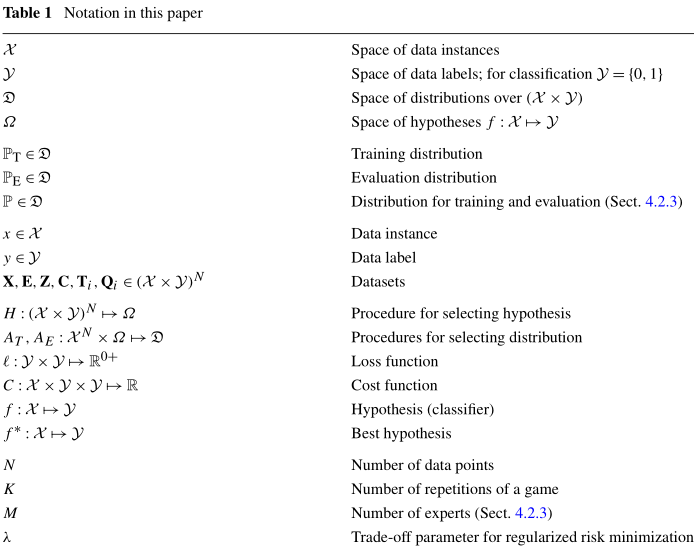

# The Security of Machine Learning

<!-- TOC -->

- [背景知识和目标](#背景知识和目标)
- [框架](#框架)
    - [安全分析](#安全分析)
    - [分类](#分类)
    - [标记](#标记)
    - [对抗学习博弈](#对抗学习博弈)
- [学习，攻击和防守](#学习攻击和防守)
    - [攻击：成因性和完整性](#攻击成因性和完整性)
    - [攻击：成因性和可用性](#攻击成因性和可用性)
    - [攻击：试探性和完整性](#攻击试探性和完整性)
    - [攻击：试探性和可用性](#攻击试探性和可用性)
    - [防御：抵抗试探性攻击](#防御抵抗试探性攻击)
        - [防御非探测攻击](#防御非探测攻击)
        - [防御探测攻击](#防御探测攻击)
    - [防御：抵抗成因性攻击](#防御抵抗成因性攻击)
- [案例研究：SpamBayes](#案例研究spambayes)
- [参考资料](#参考资料)

<!-- /TOC -->

## 背景知识和目标

* 评估学习系统的质量
* 确定它是否满足安全学习的要求
* 计算机安全评估
    * 确定系统遭受的攻击类别
    * 评估系统对这些攻击的适应能力
    * 加强系统对这些攻击抵抗的能力
* **使用相同的模型来评估安全学习**

## 框架

### 安全分析

* 安全目标
    * 完整性目标
    * 可用性目标
* 威胁模型
    * 攻击者目标/动机
        * 损失函数
            * **防御者的成本**对应着**攻击者的收益**
    * 攻击者的能力
        * 攻击者具有机器学习方面的知识
            * 训练算法
            * 训练数据集
        * 攻击者可以发起任何攻击，或按兵不动
        * 攻击者能多大的程度上控制训练数据
        * 攻击者无法控制
            * 人工添加的数据标记
            * 数据包到达的顺序

### 分类

* **影响阶段**（**能力**，是否影响训练数据）
    * **成因性**，攻击者能够通过影响训练数据而影响机器学习
    * **试探性**，导致错误分类，但不影响训练
* **违背准则**（**类型**）
    * **完整性**，漏报会从而导致安全损失
    * **可用性**，误报而带来的 DoS
* **目标明确**（**具体意图**）
    * **针对性**，攻击几种在特定的实例上
    * **随意性**，攻击包含了很广泛的类别
* **影响阶段**决定了博弈结构，步骤
* **违背准则**和**目标明确**决定了损失函数

### 标记

### 对抗学习博弈

* 探索性博弈
    * 防御者选用程序 $$H$$， 生成假设模型
    * 攻击者选用程序 $$A_E$$，生成实例分布 $$\mathbb{P}_E$$
        * 概率分布集中于高成本的实例，由此构造一个不利与评价的概率分布
* 成因性博弈
    * 防御者选用程序 $$H$$， 生成假设模型
    * 攻击者选用程序 $$A_T$$ 和 $$A_E$$，生成实例分布
* 防御者的权衡
    * 最坏情况下表现的更好，还是平均效果更弱

## 学习，攻击和防守

*“防御者”就是“学习者”*

### 攻击：成因性和完整性

* PAC学习中的污染（Kearns and Li 1993）
    * PAC，probably approximately correct
    * **学习者**
        * 有 $$P \geq 1 - \delta$$ 的概率成功
        * $$P_\text{incorrect} \leq \epsilon$$
    * **攻击者**
        * 有分数 $$\beta$$ 控制训练数据
        * 如果 $$\beta \geq \epsilon / (1 + \epsilon)$$ 则能组织学习者成功
* 垃圾邮件预告
    * **攻击者**
        * 发送类似于垃圾邮件的非垃圾邮件
        * 例如，多义词“watch”
    * **学习者**
        * 漏训练：错过垃圾邮件
* 红鲱鱼（Newsome et al. 2006）
    * **攻击者**
        * 训练时，有意引入虚假特征
        * 攻击时，缺少虚假特征，从而躲避检测
    * **学习者**
        * 把虚假特征视为恶意行为的必要特征

### 攻击：成因性和可用性

* Rogue filter（Nelson et al. 2008）
    * **攻击者**
        * 发送类似于正常邮件的垃圾邮件
            * 同事包含垃圾词汇也包含正常词汇
    * **学习者**
        * 将良性词汇与垃圾邮件联系起来
* 相关的异常值（Newsome et al. 2006）
    * **攻击者**
        * 向恶意实例添加虚假特征
    * **学习者**
        * 过滤器阻止具有这样特征的正常流量
* Allergy attack（Chung and Mok 2006, 2007）
    * 攻击蠕虫签名生成系统（Autograph）
    * **学习者**
        * 阶段一，根据行为模式，识别被感染的节点
        * 阶段二，根据受感染节点的流量特征，习得新的拦截规则
    * **攻击者**
        * 阶段一，欺骗 Autograph，使其相信攻击节点已经被感染
        * 阶段二，攻击节点发送设计好的数据包，导致 Autograph 习得新的拦截规则后拦截正常的通信流量（DoS）

### 攻击：试探性和完整性

* Shifty spammer，好词攻击（Lowd 和 Meek 2005b 以及 Wittel 和 Wu 2004）
    * **攻击者**
        * 制作垃圾邮件，逃避分类器而不直接影响分类器本身
            * 使用不太常见的同义词替换常见的垃圾邮件用词
            * 添加正常词语，以此精华垃圾邮件
* 多态混合攻击（Fogla 和 Lee 2006）
    * **攻击者**
        * 加密攻击流量，使其在统计视角上与正常流量无差别
* 模仿攻击（Tan et al. 2002）
    * 例如：攻击基于序列的IDS
        * 最短的恶意子序列长于IDS窗口大小
* 特征舍弃（FDROP，Amir Globerson 和 Sam Roweis 2006）
* 逆向工程（Lowd 和 Meek 2005a）
    * **攻击者**
        * 寻找对于分类器而言的最坏情况，对于攻击者而言是最好情况

### 攻击：试探性和可用性

* 身份错误（Moore et al. 2006）
    * **攻击者**
        * 干扰合理的使用操作而不影响训练
            * 创建垃圾邮件，把目标电子邮件地址做为垃圾邮件的发件人
            * 用大量的留言、假期回复、愤怒回复等办法塞满目标邮箱
* 欺骗
    * **学习者**
        * IPS 学习入侵流量数据，组织发起攻击的主机
    * **攻击者**
        * 攻击节点使用假的合法的 IP 地址
* 算法复杂性（Dredze et al. 2007；Wang et al. 2007）
    * **攻击者**
        * 在发送的垃圾邮件中潜入图像

### 防御：抵抗试探性攻击

#### 防御非探测攻击

* 训练数据
    * **防御者**
        * 限制攻击者可访问的信息
* 特征选择
    * **防御者**
        * 例如：在特选择征时，使用不精确的字符串匹配，来击败单词混淆的垃圾邮件
        * 避免虚假的特征
        * 正则化：平滑权重，防御特征删除
* 假设空间/机器学习程序
    * **防御者**
        * 复杂的空间难以解码，但也很难学习
        * 正则化：平衡复杂性和过度拟合

#### 防御探测攻击

* 逆向工程分析
    * **攻击者**
        * 不需要准确地描绘分类器
        * 找到最低攻击者成本的实例
    * **防御者**
        * Adversarial classifier reverse engineering（ACRE）
        * ACRE 能找到最低攻击者成本
* 随机化
    * **防御者**
        * 随机决策而不是二元决策
* 限制/误导反馈 
    * **防御者**
        * 移除邮件留言
        * 发送欺诈性反馈

### 防御：抵抗成因性攻击

* 数据清理
    * Reject On Negative Impact（RONI）
    * **学习者**
        * 训练两个分类器，其中一个包含特定样本，另一个不包含
        * 衡量他们的准确性
        * 由此来确定样本是否为黑样本
        * 排除黑样本
* 稳健性
    * 统计数据稳定，防止温水煮青蛙
        * 均值，均方差（MSE），标准差
        * 中位数，绝对中位差（MAD）
    * 适当的正规化
* 专家在线预测
    * 多分类器系统

## 案例研究：SpamBayes

| (**针对性** 或 **随意性**) | **完整性**                                                   | **可用性**                                                          |
|----------------------------|--------------------------------------------------------------|---------------------------------------------------------------------|
| **成因性**                 | **Spam foretold**：错误地训练**一个**或**任何**特定的垃圾邮件 | **Rogue filter**：过滤器错误地阻止**某些**或**任意**正常的电子邮件   |
| **试探性**                 | **Shifty spammer**：混淆**一个**或**任何**特定的垃圾邮件      | **Unwanted reply**：用垃圾邮件淹没**特定的**或**任意多个**目标收件箱 |

* 方法
    * 用合规的单词发送攻击邮件
    * 合规的单词会得到较高的垃圾邮件权重
    * 结果，合规的电子邮件可能会被过滤
* 类型
    * 随意性：字典攻击
    * 针对性：集中攻击
* 目的
    * 使得目标禁用垃圾邮件过滤器
    * DoS 攻击竞争对手

## 参考资料

* The security of machine learning, 2010
* CS 259D Session 10
