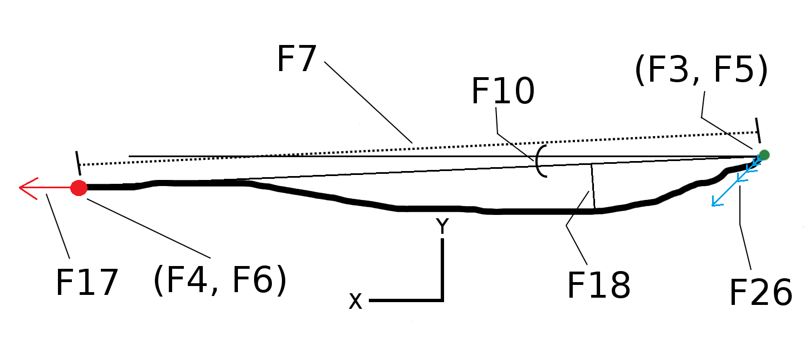

# Touchalytics: On the Applicability of Touchscreen Input as a Behavioral Biometric for Continuous Authentication

<!-- TOC -->

- [Background Knowledge and Insight](#background-knowledge-and-insight)
- [Goal](#goal)
- [Data Source](#data-source)
- [Feature](#feature)
- [Classification](#classification)
- [Limitation](#limitation)
- [Reference](#reference)

<!-- /TOC -->

## Background Knowledge and Insight

* Usability
    * Inconvenient for quick activities
* Security
    * Short passwords
    * Increased screen lock time-outs
    * Disable unlock
    * Higher risk of thief
* Human characteristics
    * Physiological biometrics
        * Fingerprints
        * Hand geometry
        * Facial features
        * DNA
    * Behavioral biometrics
        * Voice
        * Keystroke dynamics
        * Mouse movements

## Goal

* Touch-based behavioral biometric authentication

## Data Source

* Android phones
* Tasks: read documents, compare images
* Raw features:
    * Event code
        * Finger up
        * Finger down
        * Finger move
        * Multi-touch
    * Event time
    * Device orientation
    * x, y coordinates of finger
    * Finger pressure
    * Area on the screen covered by the finger
    * Finger orientation with respect to screen orientation
* Recording Tool
    * APP for reading documents and viewing different images
        * Input user ID
        * links to the documents and images

## Feature

* Stroke
    * Sequence of touch data starting with touching the screen, ending with lifting the finger
    * Sequence of vectors:
        * $$s_n = (x_n, y_n, t_n, p_n, A_n, o_n^f, o_n^{ph}),\ n \in \{1, 2, ..., N\}$$
            * $$x_n$$, $$y_n$$, location
            * $$t_n$$, time stamp
            * $$p_n$$, pressure on screen
            * $$A_n$$, area occluded by the finger
            * $$o_n^f$$, orientation of the finger
            * $$o_n^{ph}$$, orientation of the phone (landscape or portrait)
* 30 features
* Information entropy
* Most informative single features
    * Area covered by fingertip
    * Stroke velocity
    * Fingertip pressure on screen
    * Direction of the stroke
* $$x\text{-position}$$ coordinate more informative than $$y\text{-position}$$ coordinate

## Classification

* kNN
    * Using a k-d tree
    * Euclidian distance
    * k between 1-7
        * Cross-validation
* SVM
    * RBF kernel
        * 5-fold Cross-validation
* Combine scores of multiple strokes
    * Threshold the combined score

## Limitation

* Users not try to mimic the touch behavior of another user
    * Hard to mimic 30 features by human
    * Malware APP can try to learn users' behavior
* Screen size may affect touch behavior
    * Smart phone
        * Small screen
        * Need more scrolling
    * Tablet computer
        * Large screen
        * Less scrolling
        * More degrees of freedom

## Reference

* Touchalytics: On the Applicability of Touchscreen Input as a Behavioral Biometric for Continuous Authentication, 2013
* [Touchalytics](http://www.mariofrank.net/touchalytics/index.html)